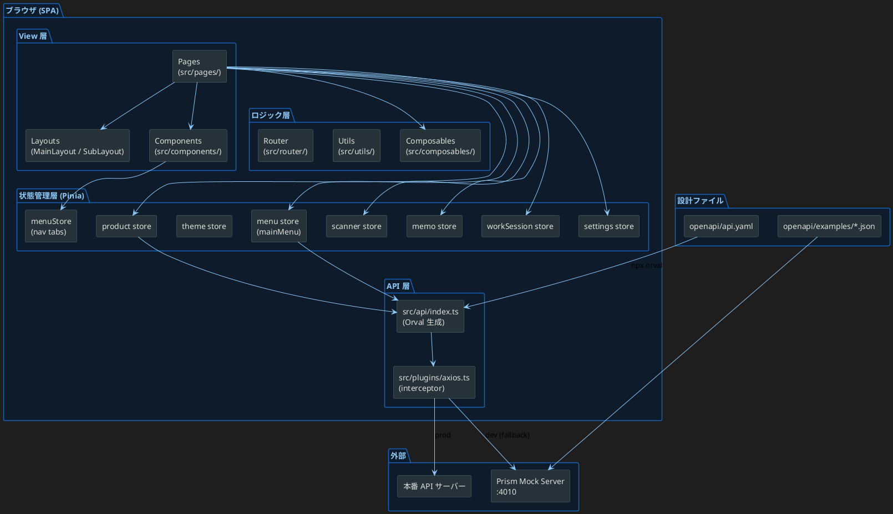

# アーキテクチャ概要

## 技術スタック

| 分類 | 技術 |
|------|------|
| フレームワーク | Vue 3 (Composition API) |
| UI ライブラリ | Vuetify 3 |
| 状態管理 | Pinia |
| ルーティング | Vue Router 4（Hash History） |
| HTTP クライアント | Axios |
| API クライアント生成 | Orval v8.15.0 |
| OpenAPI | OpenAPI 3.0 (`openapi/api.yaml`) |
| モックサーバー | Prism |
| ビルドツール | Vite |
| テスト | Vitest + Vue Test Utils |
| 言語 | TypeScript |

---

## レイヤー構成図



---

## ディレクトリ構成

```
src/
├── api/
│   └── index.ts          # Orval 自動生成（触らない）
├── components/
│   ├── dialog/           # BaseDialog, ConfirmDialog
│   ├── layout/           # MainLayout, SubLayout
│   ├── menu/             # MenuGrid, QuickScannerButton, ResumeWorkButton
│   ├── product/          # ProductCard
│   ├── scanner/          # BarcodeInputField
│   ├── search/           # ProductFilterDialog, SearchConditionChips
│   ├── settings/         # SettingsThemePanel
│   └── ui/               # 汎用 Picker 系 (SelectPickerField, DatePickerField, etc.)
├── composables/
│   ├── useAsync.ts       # API 呼び出し共通ラッパー
│   ├── useBarcodeScanner.ts
│   └── useSnackbar.ts
├── data/
│   └── main-menu.json    # メインメニュー定義（API フォールバック）
├── mocks/
│   └── products-data.json # 商品モックデータ（API フォールバック）
├── pages/                # ルートに対応するページコンポーネント
├── plugins/
│   ├── axios.ts          # Axios インスタンス・インターセプター
│   └── vuetify.ts        # Vuetify 設定・テーマ定義
├── router/
│   └── index.ts          # Vue Router 定義
├── stores/               # Pinia stores
├── types/                # 共通型定義
└── utils/
    └── searchUtils.ts    # 検索フィルタ・クエリ生成
openapi/
├── api.yaml              # OpenAPI 定義（起点）
└── examples/             # Prism 用モックレスポンス
docs/                     # 本ドキュメント群
```

---

## データフロー概要

```
ユーザー操作
  │
  ▼
Page コンポーネント
  │  useXxxStore()
  ▼
Pinia Store
  │  getAppAPI().getXxx()
  ▼
src/api/index.ts (Orval 生成)
  │  customAxiosInstance()
  ▼
src/plugins/axios.ts
  │  baseURL: http://localhost:4010 (dev)
  ▼
Prism Mock Server / 本番 API
  │
  ▼  成功
Store に格納 → Page に反映
  │
  ▼  失敗（net::ERR_CONNECTION_REFUSED 等）
JSON フォールバック（src/mocks/ or src/data/）
```
