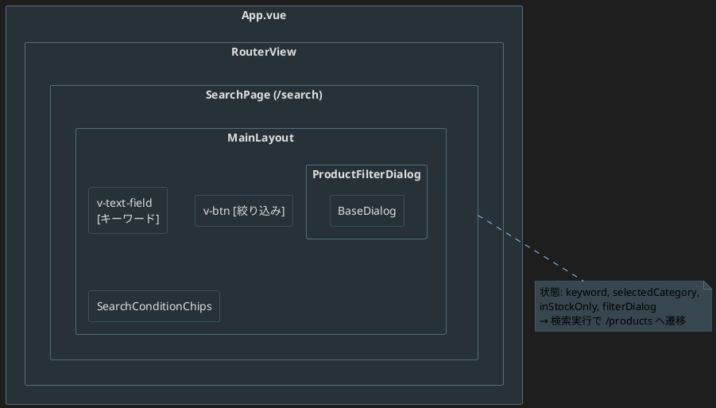
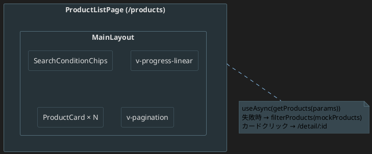
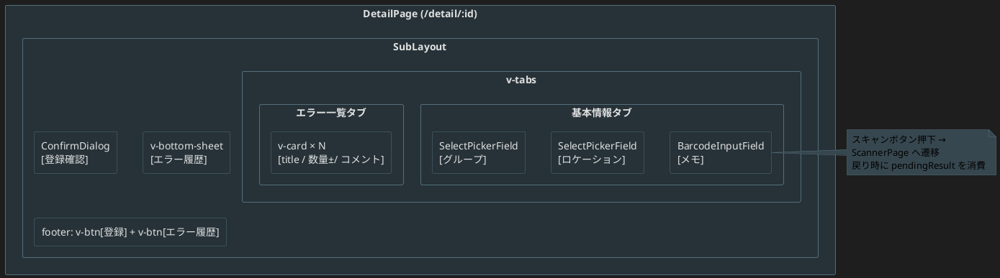
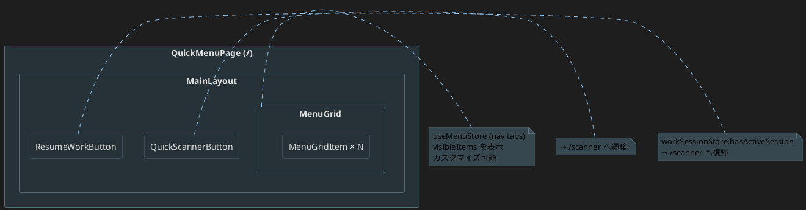
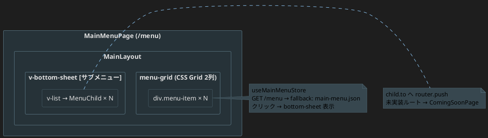
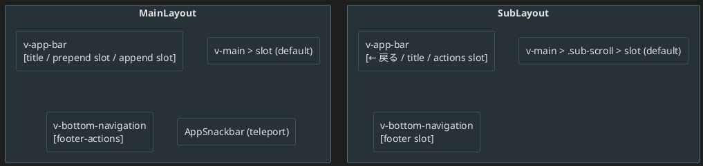

# コンポーネントツリー

## 検索フロー

```plantuml
@startuml component-tree-search
skinparam DefaultFontName "Noto Sans JP"
skinparam BackgroundColor #1e1e1e
skinparam ArrowColor #90CAF9
skinparam RectangleBorderColor #546E7A
skinparam RectangleBackgroundColor #263238
skinparam RectangleFontColor #E0E0E0
skinparam NoteBackgroundColor #37474F
skinparam NoteBorderColor #546E7A
skinparam NoteTextColor #CFD8DC

' 検索ページ
rectangle "App.vue" as app {
  rectangle "RouterView" as rv1 {

    rectangle "SearchPage (/search)" as search {
      rectangle "MainLayout" as ml1 {
        rectangle "v-text-field\n[キーワード]" as kw
        rectangle "v-btn [絞り込み]" as filter_btn
        rectangle "SearchConditionChips" as chips1
        rectangle "ProductFilterDialog" as dialog {
          rectangle "BaseDialog" as bd
        }
      }
    }

  }
}

note bottom of search
  状態: keyword, selectedCategory,
  inStockOnly, filterDialog
  → 検索実行で /products へ遷移
end note
```

```plantuml
@startuml component-tree-product-list
skinparam DefaultFontName "Noto Sans JP"
skinparam BackgroundColor #1e1e1e
skinparam ArrowColor #90CAF9
skinparam RectangleBorderColor #546E7A
skinparam RectangleBackgroundColor #263238
skinparam RectangleFontColor #E0E0E0
skinparam NoteBackgroundColor #37474F
skinparam NoteBorderColor #546E7A
skinparam NoteTextColor #CFD8DC

rectangle "ProductListPage (/products)" as pl {
  rectangle "MainLayout" as ml2 {
    rectangle "SearchConditionChips" as chips2
    rectangle "v-progress-linear" as prog
    rectangle "ProductCard × N" as cards
    rectangle "v-pagination" as pagi
  }
}

note bottom of pl
  useAsync(getProducts(params))
  失敗時 → filterProducts(mockProducts)
  カードクリック → /detail/:id
end note
```

```plantuml
@startuml component-tree-detail
skinparam DefaultFontName "Noto Sans JP"
skinparam BackgroundColor #1e1e1e
skinparam ArrowColor #90CAF9
skinparam RectangleBorderColor #546E7A
skinparam RectangleBackgroundColor #263238
skinparam RectangleFontColor #E0E0E0
skinparam NoteBackgroundColor #37474F
skinparam NoteBorderColor #546E7A
skinparam NoteTextColor #CFD8DC

rectangle "DetailPage (/detail/:id)" as detail {
  rectangle "SubLayout" as sl {
    rectangle "v-tabs" as tabs {
      rectangle "基本情報タブ" as info_tab {
        rectangle "SelectPickerField\n[ロケーション]" as loc
        rectangle "SelectPickerField\n[グループ]" as grp
        rectangle "BarcodeInputField\n[メモ]" as barcode
      }
      rectangle "エラー一覧タブ" as issues_tab {
        rectangle "v-card × N\n[title / 数量±/ コメント]" as issue_cards
      }
    }
    rectangle "ConfirmDialog\n[登録確認]" as confirm
    rectangle "v-bottom-sheet\n[エラー履歴]" as error_sheet
    rectangle "footer: v-btn[登録] + v-btn[エラー履歴]" as footer_detail
  }
}

note right of barcode
  スキャンボタン押下 →
  ScannerPage へ遷移
  戻り時に pendingResult を消費
end note
```

---

## メニューフロー

```plantuml
@startuml component-tree-menu
skinparam DefaultFontName "Noto Sans JP"
skinparam BackgroundColor #1e1e1e
skinparam ArrowColor #90CAF9
skinparam RectangleBorderColor #546E7A
skinparam RectangleBackgroundColor #263238
skinparam RectangleFontColor #E0E0E0
skinparam NoteBackgroundColor #37474F
skinparam NoteBorderColor #546E7A
skinparam NoteTextColor #CFD8DC

rectangle "QuickMenuPage (/)" as quick {
  rectangle "MainLayout" as ml_quick {
    rectangle "MenuGrid" as mg {
      rectangle "MenuGridItem × N" as mgi
    }
    rectangle "QuickScannerButton" as qsb
    rectangle "ResumeWorkButton" as rwb
  }
}

note right of mg
  useMenuStore (nav tabs)
  visibleItems を表示
  カスタマイズ可能
end note

note right of qsb
  → /scanner へ遷移
end note

note right of rwb
  workSessionStore.hasActiveSession
  → /scanner へ復帰
end note
```

```plantuml
@startuml component-tree-mainmenu
skinparam DefaultFontName "Noto Sans JP"
skinparam BackgroundColor #1e1e1e
skinparam ArrowColor #90CAF9
skinparam RectangleBorderColor #546E7A
skinparam RectangleBackgroundColor #263238
skinparam RectangleFontColor #E0E0E0
skinparam NoteBackgroundColor #37474F
skinparam NoteBorderColor #546E7A
skinparam NoteTextColor #CFD8DC

rectangle "MainMenuPage (/menu)" as mmenu {
  rectangle "MainLayout" as ml_menu {
    rectangle "menu-grid (CSS Grid 2列)" as grid {
      rectangle "div.menu-item × N" as items
    }
    rectangle "v-bottom-sheet [サブメニュー]" as sheet {
      rectangle "v-list → MenuChild × N" as children
    }
  }
}

note right of items
  useMainMenuStore
  GET /menu → fallback: main-menu.json
  クリック → bottom-sheet 表示
end note

note right of children
  child.to へ router.push
  未実装ルート → ComingSoonPage
end note
```

---

## 共通レイアウト構造

```plantuml
@startuml layout-structure
skinparam DefaultFontName "Noto Sans JP"
skinparam BackgroundColor #1e1e1e
skinparam ArrowColor #90CAF9
skinparam RectangleBorderColor #546E7A
skinparam RectangleBackgroundColor #263238
skinparam RectangleFontColor #E0E0E0

rectangle "MainLayout" as main_layout {
  rectangle "v-app-bar\n[title / prepend slot / append slot]" as appbar_m
  rectangle "v-main > slot (default)" as main_m
  rectangle "v-bottom-navigation\n[footer-actions]" as footer_m
  rectangle "AppSnackbar (teleport)" as snack_m
}

rectangle "SubLayout" as sub_layout {
  rectangle "v-app-bar\n[← 戻る / title / actions slot]" as appbar_s
  rectangle "v-main > .sub-scroll > slot (default)" as main_s
  rectangle "v-bottom-navigation\n[footer slot]" as footer_s
}
```
