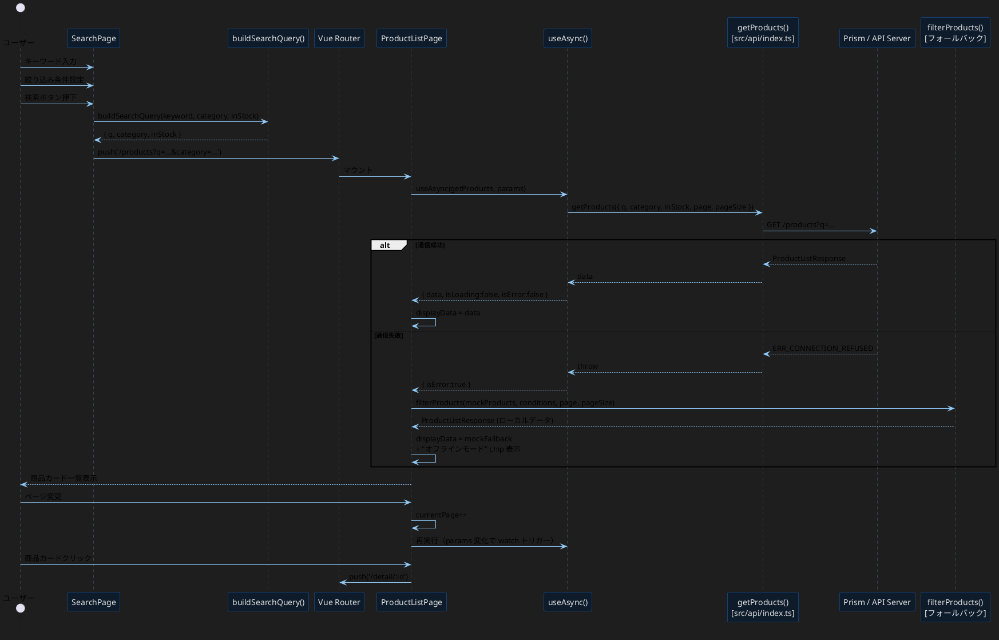
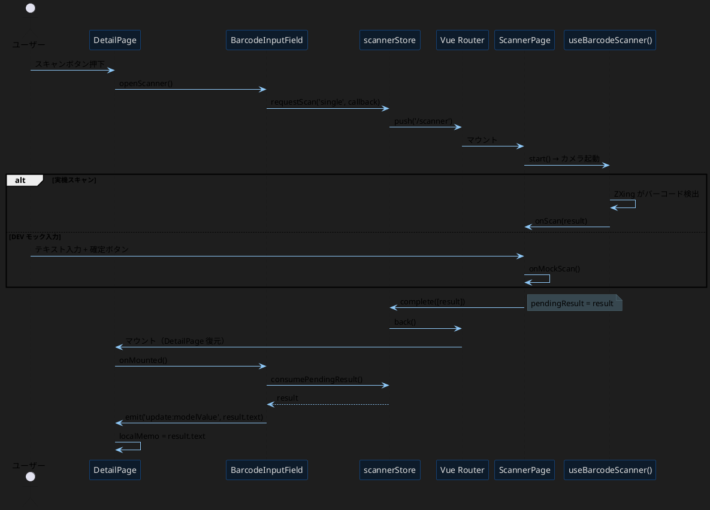
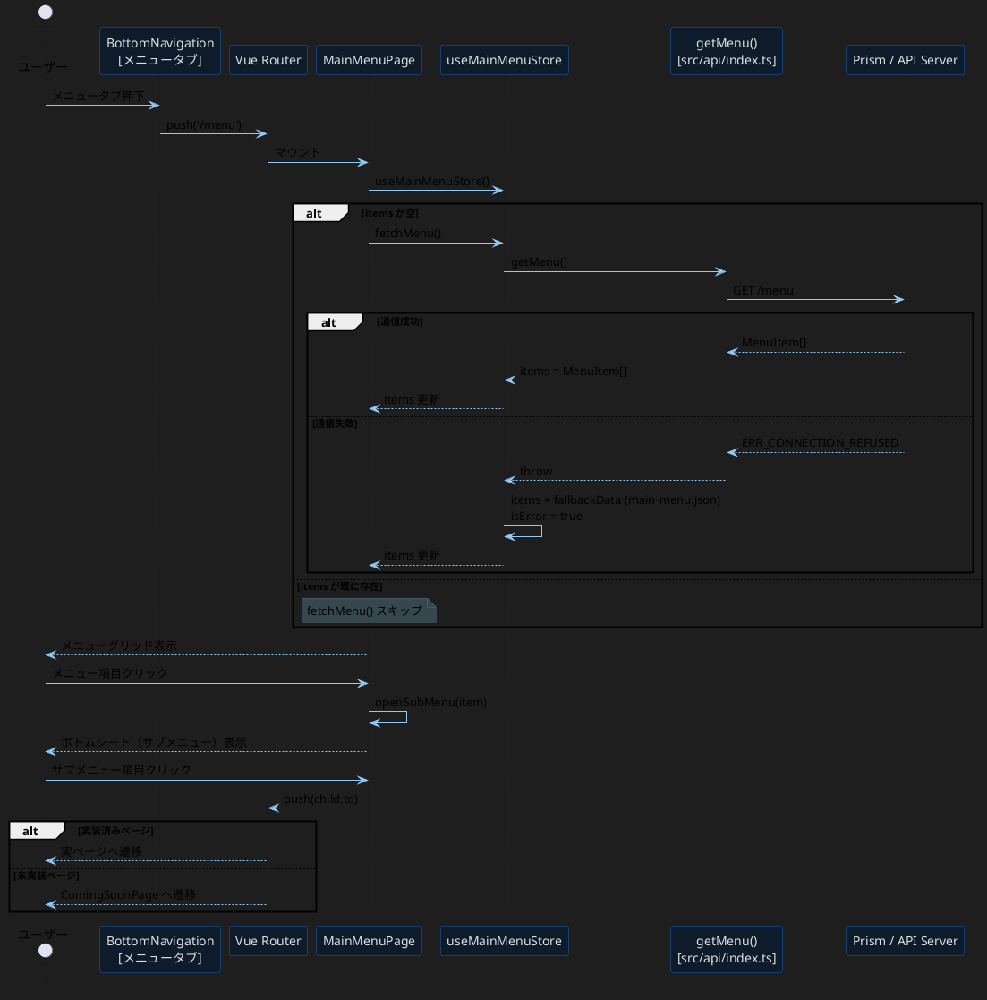
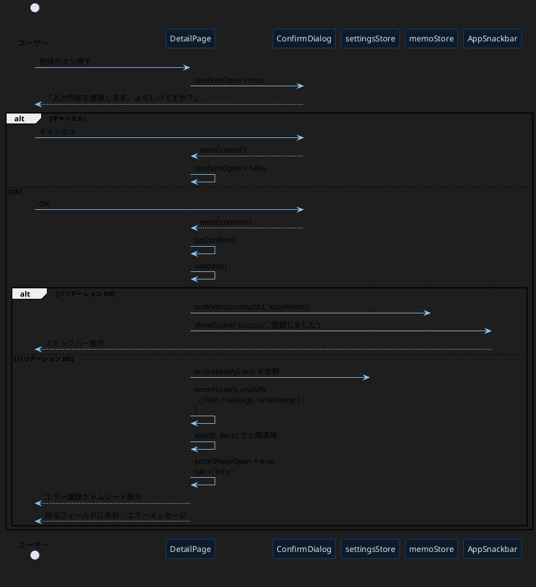

# シーケンス図

## 検索フロー

### 1. キーワード検索 → 一覧表示

```plantuml
@startuml sequence-search
skinparam DefaultFontName "Noto Sans JP"
skinparam BackgroundColor #1e1e1e
skinparam SequenceArrowColor #90CAF9
skinparam SequenceBoxBorderColor #546E7A
skinparam SequenceBoxBackgroundColor #263238
skinparam SequenceLifeLineBorderColor #546E7A
skinparam SequenceParticipantBorderColor #1565C0
skinparam SequenceParticipantBackgroundColor #0D1B2A
skinparam SequenceParticipantFontColor #E0E0E0
skinparam NoteBackgroundColor #37474F
skinparam NoteBorderColor #546E7A
skinparam NoteTextColor #CFD8DC

actor ユーザー as user
participant "SearchPage" as sp
participant "buildSearchQuery()" as bsq
participant "Vue Router" as router
participant "ProductListPage" as plp
participant "useAsync()" as ua
participant "getProducts()\n[src/api/index.ts]" as api
participant "Prism / API Server" as server
participant "filterProducts()\n[フォールバック]" as fb

user -> sp : キーワード入力
user -> sp : 絞り込み条件設定
user -> sp : 検索ボタン押下

sp -> bsq : buildSearchQuery(keyword, category, inStock)
bsq --> sp : { q, category, inStock }

sp -> router : push('/products?q=...&category=...')
router -> plp : マウント

plp -> ua : useAsync(getProducts, params)
ua -> api : getProducts({ q, category, inStock, page, pageSize })
api -> server : GET /products?q=...

alt 通信成功
  server --> api : ProductListResponse
  api --> ua : data
  ua --> plp : { data, isLoading:false, isError:false }
  plp -> plp : displayData = data
else 通信失敗
  server --> api : ERR_CONNECTION_REFUSED
  api --> ua : throw
  ua --> plp : { isError:true }
  plp -> fb : filterProducts(mockProducts, conditions, page, pageSize)
  fb --> plp : ProductListResponse (ローカルデータ)
  plp -> plp : displayData = mockFallback\n+ "オフラインモード" chip 表示
end

plp --> user : 商品カード一覧表示

user -> plp : ページ変更
plp -> plp : currentPage++
plp -> ua : 再実行（params 変化で watch トリガー）

user -> plp : 商品カードクリック
plp -> router : push('/detail/:id')

@enduml
```

### 2. 詳細 → スキャン → メモ反映

```plantuml
@startuml sequence-scan
skinparam DefaultFontName "Noto Sans JP"
skinparam BackgroundColor #1e1e1e
skinparam SequenceArrowColor #90CAF9
skinparam SequenceParticipantBorderColor #1565C0
skinparam SequenceParticipantBackgroundColor #0D1B2A
skinparam SequenceParticipantFontColor #E0E0E0
skinparam NoteBackgroundColor #37474F
skinparam NoteBorderColor #546E7A
skinparam NoteTextColor #CFD8DC

actor ユーザー as user
participant "DetailPage" as dp
participant "BarcodeInputField" as bif
participant "scannerStore" as ss
participant "Vue Router" as router
participant "ScannerPage" as scan
participant "useBarcodeScanner()" as ubc

user -> dp : スキャンボタン押下
dp -> bif : openScanner()
bif -> ss : requestScan('single', callback)
ss -> router : push('/scanner')
router -> scan : マウント

scan -> ubc : start() → カメラ起動

alt 実機スキャン
  ubc -> ubc : ZXing がバーコード検出
  ubc -> scan : onScan(result)
else DEV モック入力
  user -> scan : テキスト入力 + 確定ボタン
  scan -> scan : onMockScan()
end

scan -> ss : complete([result])
note right : pendingResult = result
ss -> router : back()

router -> dp : マウント（DetailPage 復元）
dp -> bif : onMounted()
bif -> ss : consumePendingResult()
ss --> bif : result
bif -> dp : emit('update:modelValue', result.text)
dp -> dp : localMemo = result.text

@enduml
```

---

## メニューフロー

### 3. メインメニュー表示

```plantuml
@startuml sequence-mainmenu
skinparam DefaultFontName "Noto Sans JP"
skinparam BackgroundColor #1e1e1e
skinparam SequenceArrowColor #90CAF9
skinparam SequenceParticipantBorderColor #1565C0
skinparam SequenceParticipantBackgroundColor #0D1B2A
skinparam SequenceParticipantFontColor #E0E0E0
skinparam NoteBackgroundColor #37474F
skinparam NoteBorderColor #546E7A
skinparam NoteTextColor #CFD8DC

actor ユーザー as user
participant "BottomNavigation\n[メニュータブ]" as nav
participant "Vue Router" as router
participant "MainMenuPage" as mmp
participant "useMainMenuStore" as store
participant "getMenu()\n[src/api/index.ts]" as api
participant "Prism / API Server" as server

user -> nav : メニュータブ押下
nav -> router : push('/menu')
router -> mmp : マウント

mmp -> store : useMainMenuStore()

alt items が空
  mmp -> store : fetchMenu()
  store -> api : getMenu()
  api -> server : GET /menu

  alt 通信成功
    server --> api : MenuItem[]
    api --> store : items = MenuItem[]
    store --> mmp : items 更新
  else 通信失敗
    server --> api : ERR_CONNECTION_REFUSED
    api --> store : throw
    store -> store : items = fallbackData (main-menu.json)\nisError = true
    store --> mmp : items 更新
  end
else items が既に存在
  note over mmp : fetchMenu() スキップ
end

mmp --> user : メニューグリッド表示

user -> mmp : メニュー項目クリック
mmp -> mmp : openSubMenu(item)
mmp --> user : ボトムシート（サブメニュー）表示

user -> mmp : サブメニュー項目クリック
mmp -> router : push(child.to)

alt 実装済みページ
  router --> user : 実ページへ遷移
else 未実装ページ
  router --> user : ComingSoonPage へ遷移
end

@enduml
```

### 4. 登録バリデーション → エラー履歴

```plantuml
@startuml sequence-save
skinparam DefaultFontName "Noto Sans JP"
skinparam BackgroundColor #1e1e1e
skinparam SequenceArrowColor #90CAF9
skinparam SequenceParticipantBorderColor #1565C0
skinparam SequenceParticipantBackgroundColor #0D1B2A
skinparam SequenceParticipantFontColor #E0E0E0
skinparam NoteBackgroundColor #37474F
skinparam NoteBorderColor #546E7A
skinparam NoteTextColor #CFD8DC

actor ユーザー as user
participant "DetailPage" as dp
participant "ConfirmDialog" as cd
participant "settingsStore" as ss
participant "memoStore" as ms
participant "AppSnackbar" as snack

user -> dp : 登録ボタン押下
dp -> cd : confirmOpen = true
cd --> user : 「入力内容を登録します。よろしいですか？」

alt キャンセル
  user -> cd : キャンセル
  cd --> dp : emit('cancel')
  dp -> dp : confirmOpen = false
else OK
  user -> cd : OK
  cd --> dp : emit('confirm')
  dp -> dp : onConfirm()
  dp -> dp : validate()

  alt バリデーション OK
    dp -> ms : setMemo(productId, localMemo)
    dp -> snack : showSnack('success', '登録しました')
    snack --> user : スナックバー表示
  else バリデーション NG
    dp -> ss : errorHistoryLimit を参照
    dp -> dp : errorHistory.unshift(\n  { field, message, timestamp }\n)
    dp -> dp : slice(0, limit) で上限適用
    dp -> dp : errorSheetOpen = true\ntab = 'info'
    dp --> user : エラー履歴ボトムシート表示
    dp --> user : 該当フィールドに赤枠・エラーメッセージ
  end
end

@enduml
```
