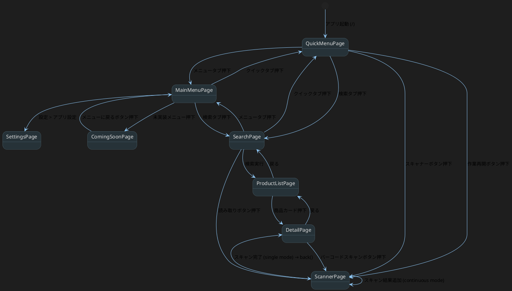
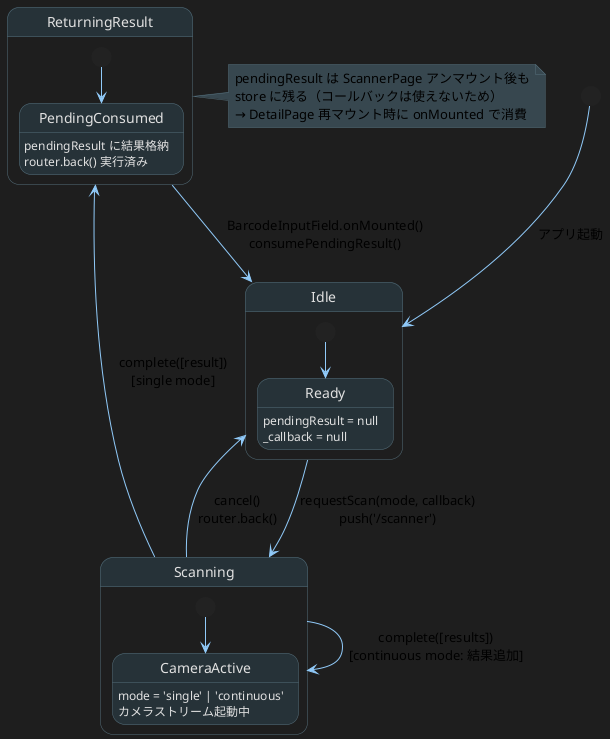
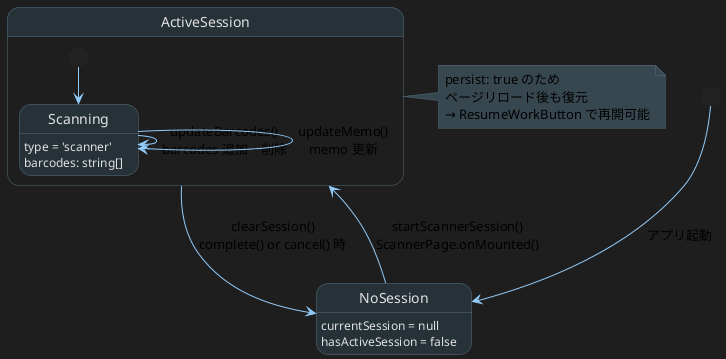
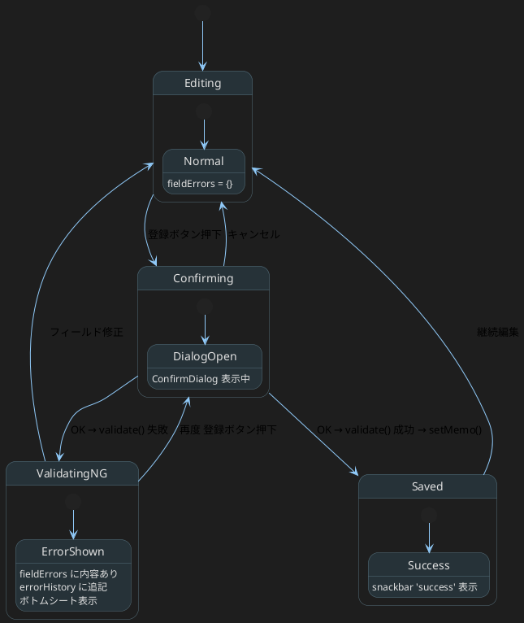

# 状態遷移図

## 画面遷移

```plantuml
@startuml screen-transition
skinparam DefaultFontName "Noto Sans JP"
skinparam BackgroundColor #1e1e1e
skinparam ArrowColor #90CAF9
skinparam StateBorderColor #546E7A
skinparam StateBackgroundColor #263238
skinparam StateFontColor #E0E0E0
skinparam NoteBackgroundColor #37474F
skinparam NoteBorderColor #546E7A
skinparam NoteTextColor #CFD8DC

[*] --> QuickMenuPage : アプリ起動 (/)

QuickMenuPage --> MainMenuPage : メニュータブ押下
QuickMenuPage --> SearchPage : 検索タブ押下
QuickMenuPage --> ScannerPage : スキャナーボタン押下
QuickMenuPage --> ScannerPage : 作業再開ボタン押下

MainMenuPage --> QuickMenuPage : クイックタブ押下
MainMenuPage --> SearchPage : 検索タブ押下
MainMenuPage --> ComingSoonPage : 未実装メニュー押下
MainMenuPage --> SettingsPage : 設定 > アプリ設定

SearchPage --> QuickMenuPage : クイックタブ押下
SearchPage --> MainMenuPage : メニュータブ押下
SearchPage --> ProductListPage : 検索実行
SearchPage --> ScannerPage : 読み取りボタン押下

ProductListPage --> DetailPage : 商品カード押下
ProductListPage --> SearchPage : 戻る

DetailPage --> ScannerPage : バーコードスキャンボタン押下
DetailPage --> ProductListPage : 戻る

ScannerPage --> DetailPage : スキャン完了 (single mode) → back()
ScannerPage --> ScannerPage : スキャン結果追加 (continuous mode)

ComingSoonPage --> MainMenuPage : メニューに戻るボタン押下

@enduml
```

---

## バーコードスキャナー状態遷移

```plantuml
@startuml scanner-state
skinparam DefaultFontName "Noto Sans JP"
skinparam BackgroundColor #1e1e1e
skinparam ArrowColor #90CAF9
skinparam StateBorderColor #546E7A
skinparam StateBackgroundColor #263238
skinparam StateFontColor #E0E0E0
skinparam NoteBackgroundColor #37474F
skinparam NoteBorderColor #546E7A
skinparam NoteTextColor #CFD8DC

[*] --> Idle : アプリ起動

state Idle {
  [*] --> Ready
  Ready : pendingResult = null
  Ready : _callback = null
}

state Scanning {
  [*] --> CameraActive
  CameraActive : mode = 'single' | 'continuous'
  CameraActive : カメラストリーム起動中
}

state ReturningResult {
  [*] --> PendingConsumed
  PendingConsumed : pendingResult に結果格納
  PendingConsumed : router.back() 実行済み
}

Idle --> Scanning : requestScan(mode, callback)\npush('/scanner')

Scanning --> Idle : cancel()\nrouter.back()

Scanning --> ReturningResult : complete([result])\n[single mode]
Scanning --> Scanning : complete([results])\n[continuous mode: 結果追加]

ReturningResult --> Idle : BarcodeInputField.onMounted()\nconsumePendingResult()

note right of ReturningResult
  pendingResult は ScannerPage アンマウント後も
  store に残る（コールバックは使えないため）
  → DetailPage 再マウント時に onMounted で消費
end note

@enduml
```

---

## ワークセッション状態遷移

```plantuml
@startuml worksession-state
skinparam DefaultFontName "Noto Sans JP"
skinparam BackgroundColor #1e1e1e
skinparam ArrowColor #90CAF9
skinparam StateBorderColor #546E7A
skinparam StateBackgroundColor #263238
skinparam StateFontColor #E0E0E0
skinparam NoteBackgroundColor #37474F
skinparam NoteBorderColor #546E7A
skinparam NoteTextColor #CFD8DC

[*] --> NoSession : アプリ起動

NoSession : currentSession = null
NoSession : hasActiveSession = false

state ActiveSession {
  [*] --> Scanning
  Scanning : type = 'scanner'
  Scanning : barcodes: string[]
  Scanning --> Scanning : updateBarcodes()\nbarcodes 追加・削除
  Scanning --> Scanning : updateMemo()\nmemo 更新
}

NoSession --> ActiveSession : startScannerSession()\nScannerPage.onMounted()
ActiveSession --> NoSession : clearSession()\ncomplete() or cancel() 時

note right of ActiveSession
  persist: true のため
  ページリロード後も復元
  → ResumeWorkButton で再開可能
end note

@enduml
```

---

## DetailPage バリデーション状態遷移

```plantuml
@startuml validation-state
skinparam DefaultFontName "Noto Sans JP"
skinparam BackgroundColor #1e1e1e
skinparam ArrowColor #90CAF9
skinparam StateBorderColor #546E7A
skinparam StateBackgroundColor #263238
skinparam StateFontColor #E0E0E0
skinparam NoteBackgroundColor #37474F
skinparam NoteBorderColor #546E7A
skinparam NoteTextColor #CFD8DC

[*] --> Editing

state Editing {
  [*] --> Normal
  Normal : fieldErrors = {}
}

state Confirming {
  [*] --> DialogOpen
  DialogOpen : ConfirmDialog 表示中
}

state ValidatingNG {
  [*] --> ErrorShown
  ErrorShown : fieldErrors に内容あり
  ErrorShown : errorHistory に追記
  ErrorShown : ボトムシート表示
}

state Saved {
  [*] --> Success
  Success : snackbar 'success' 表示
}

Editing --> Confirming : 登録ボタン押下
Confirming --> Editing : キャンセル
Confirming --> ValidatingNG : OK → validate() 失敗
Confirming --> Saved : OK → validate() 成功 → setMemo()
ValidatingNG --> Editing : フィールド修正
ValidatingNG --> Confirming : 再度 登録ボタン押下
Saved --> Editing : 継続編集

@enduml
```
