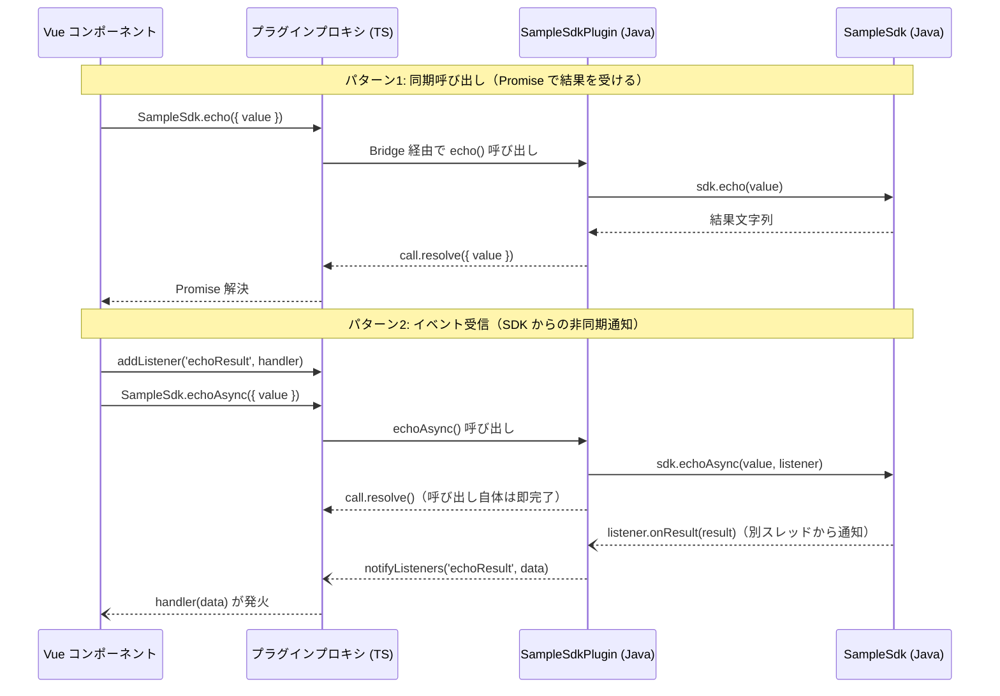

# Capacitor 経由でネイティブ SDK（Java）を利用するガイド

Vue（WebView）から Java の SDK を呼び出すための概念と手順をまとめたガイド。
題材として **SampleSdk（社内 SDK を想定したダミー Java クラス）** を使い、
「画面で入力した値を SDK に渡し、SDK を通ってそのまま返ってくる」エコー往復を最小構成で動かす。

- **対象読者**: このプロジェクトで Android ネイティブ連携を初めて触る人
- **前提**: Capacitor 7 / Android プロジェクト導入済み（`android/` 配下）、パッケージ名 `com.example.myapp`
- **ゴール**: 同期呼び出しとイベント受信の 2 パターンで JS ↔ Java の往復を理解し、実 SDK（スキャナー SDK 等）に置き換えられる状態になる

---

## 1. 概念編

### 1.1 WebView とネイティブは直接つながらない

このアプリの Vue コードは Android 上では **WebView の中** で動く JavaScript であり、
Java のクラスを直接 `import` することはできない。両者の橋渡しをするのが **Capacitor Bridge**。

```
┌─────────────────────────────────────────────┐
│ Android アプリ（Java の世界）                  │
│                                             │
│  ┌───────────────────────────┐              │
│  │ WebView（JS の世界）        │              │
│  │  Vue / Pinia / Router      │              │
│  └────────────┬──────────────┘              │
│               │ Capacitor Bridge（JSON メッセージ）│
│  ┌────────────┴──────────────┐              │
│  │ Capacitor プラグイン（Java） │              │
│  │   └→ SDK（.jar / .aar）    │              │
│  └───────────────────────────┘              │
└─────────────────────────────────────────────┘
```

- JS 側は `registerPlugin()` で得たプロキシオブジェクトのメソッドを呼ぶだけ
- Capacitor が引数を JSON にシリアライズして Java 側の `@PluginMethod` に届け、結果を Promise で返す
- つまり **JS ↔ Java の受け渡しは「JSON にできる値」だけ**（文字列・数値・真偽値・配列・オブジェクト）。
  Java のオブジェクトそのものは渡せないので、プラグインが SDK の入出力を JSON に変換する役割を持つ

### 1.2 呼び出しの全体像



### 1.3 3 つの呼び出しパターン

| パターン | JS 側 | Java 側 | 用途例 |
|---------|-------|---------|--------|
| ① 同期呼び出し | `await plugin.method()` | `call.resolve(ret)` / `call.reject(msg)` | 検証・変換・設定取得など、呼んだらすぐ結果が返るもの |
| ② イベント受信 | `plugin.addListener('event', fn)` | SDK のコールバック → `notifyListeners('event', data)` | スキャン結果の受信、デバイスの状態変化通知 |
| ③ 長時間処理 | ①と同じ（Promise が長く待つ） | ワーカースレッドで実行し、完了時に `call.resolve()` | 大量データ処理、同期バッチ |

実スキャナー SDK では「スキャナー開始/停止 = ①」「読み取り結果の受信 = ②」の組み合わせになるのが典型。

### 1.4 実装形態の選択肢

| 形態 | 置き場所 | 向いている状況 |
|------|---------|--------------|
| **ローカルプラグイン（推奨・本ガイドの方式）** | `android/app/` 配下に Java クラスを直接追加 | このアプリ専用。まず動かす段階。npm パッケージ化の手間なし |
| 独立プラグインパッケージ | `npm init @capacitor/plugin` で別リポジトリ/別パッケージ | 複数アプリで共有する段階。iOS 実装も揃えたいとき |

初手はローカルプラグインで十分。共有が必要になった時点でパッケージへ切り出せばよい
（プラグインクラスのコードはほぼそのまま移植できる）。

---

## 2. 手順編 — SampleSdk エコー往復を動かす

### 2.0 作るファイルの全体像

| # | ファイル | 役割 |
|---|---------|------|
| 1 | `android/app/src/main/java/com/example/myapp/sdk/SampleSdk.java` | 社内 SDK を想定したダミー（実 SDK なら .jar/.aar 配置に置き換わる） |
| 2 | `android/app/src/main/java/com/example/myapp/SampleSdkPlugin.java` | Capacitor プラグイン（SDK と Bridge の橋渡し） |
| 3 | `android/app/src/main/java/com/example/myapp/MainActivity.java` | プラグイン登録（既存ファイルに追記） |
| 4 | `src/plugins/sampleSdk.ts` | TS 側の型定義とプラグイン登録 |
| 5 | `src/plugins/sampleSdkWeb.ts` | ブラウザ開発用の Web フォールバック |
| 6 | `src/pages/SdkEchoSamplePage.vue` | 動作確認用の画面（入力 → 送信 → 返却表示） |

### Step 1: SDK の配置

**実 SDK（.jar / .aar）を使う場合**は `android/app/libs/` に置く。
このプロジェクトの `android/app/build.gradle` には既に

```groovy
implementation fileTree(include: ['*.jar'], dir: 'libs')
```

があるため、**.jar は libs に置くだけで依存に入る**。.aar の場合は include に追加する:

```groovy
implementation fileTree(include: ['*.jar', '*.aar'], dir: 'libs')
```

**本ガイドではダミーの Java クラスで SDK を代用**する。中身は「受け取った値をそのまま返す」だけ:

```java
// android/app/src/main/java/com/example/myapp/sdk/SampleSdk.java
package com.example.myapp.sdk;

/** 社内 SDK を想定したダミー。受け取った値をそのまま返す。 */
public class SampleSdk {

    /** SDK からの非同期通知を受けるリスナー（実 SDK のコールバック相当） */
    public interface ResultListener {
        void onResult(String value);
    }

    /** 同期呼び出し: 値をそのまま返す */
    public String echo(String value) {
        return value;
    }

    /** 非同期呼び出し: 別スレッドで少し待ってからリスナーへ通知（デバイス応答を模擬） */
    public void echoAsync(String value, ResultListener listener) {
        new Thread(() -> {
            try {
                Thread.sleep(300);
            } catch (InterruptedException ignored) {
            }
            listener.onResult(value);
        }).start();
    }
}
```

実 SDK に差し替えるときは、このクラスの代わりに .jar/.aar 内のクラスを import して使う。
プラグイン側（Step 2）の構造は変わらない。

### Step 2: プラグインクラスを作る

Bridge から呼ばれる入口。`@CapacitorPlugin` の `name` が JS 側から見た名前になる。

```java
// android/app/src/main/java/com/example/myapp/SampleSdkPlugin.java
package com.example.myapp;

import com.example.myapp.sdk.SampleSdk;
import com.getcapacitor.JSObject;
import com.getcapacitor.Plugin;
import com.getcapacitor.PluginCall;
import com.getcapacitor.PluginMethod;
import com.getcapacitor.annotation.CapacitorPlugin;

@CapacitorPlugin(name = "SampleSdk")
public class SampleSdkPlugin extends Plugin {

    private final SampleSdk sdk = new SampleSdk();

    /** パターン①: 同期呼び出し。結果を Promise（call.resolve）で返す */
    @PluginMethod
    public void echo(PluginCall call) {
        String value = call.getString("value");
        if (value == null) {
            call.reject("value は必須です");
            return;
        }
        String result = sdk.echo(value);
        JSObject ret = new JSObject();
        ret.put("value", result);
        call.resolve(ret);
    }

    /** パターン②: イベント受信。SDK のコールバックを notifyListeners で JS へ流す */
    @PluginMethod
    public void echoAsync(PluginCall call) {
        String value = call.getString("value");
        if (value == null) {
            call.reject("value は必須です");
            return;
        }
        sdk.echoAsync(value, result -> {
            JSObject data = new JSObject();
            data.put("value", result);
            notifyListeners("echoResult", data);
        });
        call.resolve(); // 呼び出し自体は即完了。結果は echoResult イベントで届く
    }
}
```

ポイント:

- `PluginCall` が JS からの引数（`call.getString` 等）と応答（`resolve` / `reject`）の両方を担う
- `notifyListeners("イベント名", data)` は **SDK がどのスレッドから通知してきても呼んでよい**（Bridge が処理する）
- エラーは `call.reject(message)` で返すと JS 側の Promise が reject される

### Step 3: MainActivity にプラグインを登録する

アプリ内ローカルプラグインは **自動登録されない** ため、`super.onCreate` より前に登録する:

```java
// android/app/src/main/java/com/example/myapp/MainActivity.java
package com.example.myapp;

import android.os.Bundle;
import com.getcapacitor.BridgeActivity;

public class MainActivity extends BridgeActivity {
    @Override
    public void onCreate(Bundle savedInstanceState) {
        registerPlugin(SampleSdkPlugin.class); // super.onCreate より前
        super.onCreate(savedInstanceState);
    }
}
```

> npm でインストールするプラグイン（@capacitor/camera 等）は `npx cap sync` が自動登録するが、
> アプリ内に直接書いたプラグインはこの 1 行が必要。忘れると実機で
> `"SampleSdk" plugin is not implemented on android` エラーになる（トラブルシューティング参照）。

### Step 4: TS 側の型定義とプラグイン登録

JS からは `registerPlugin<T>()` で型付きプロキシを取得する。

```ts
// src/plugins/sampleSdk.ts
import { registerPlugin } from '@capacitor/core'
import type { PluginListenerHandle } from '@capacitor/core'

export interface EchoResult {
  value: string
}

export interface SampleSdkPlugin {
  /** パターン①: 値を渡して結果を Promise で受け取る */
  echo(options: { value: string }): Promise<EchoResult>
  /** パターン②: 結果は echoResult イベントで届く */
  echoAsync(options: { value: string }): Promise<void>
  addListener(
    eventName: 'echoResult',
    listener: (data: EchoResult) => void,
  ): Promise<PluginListenerHandle>
  removeAllListeners(): Promise<void>
}

export const SampleSdk = registerPlugin<SampleSdkPlugin>('SampleSdk', {
  web: () => import('./sampleSdkWeb').then((m) => new m.SampleSdkWeb()),
})
```

- `'SampleSdk'` は Java 側 `@CapacitorPlugin(name = "SampleSdk")` と一致させる
- 第 2 引数の `web:` が **プラットフォーム別フォールバック**（Step 5）。
  Android 実機ではネイティブ実装が優先され、ブラウザではここで指定した Web 実装が使われる

### Step 5: Web フォールバックを作る

このプロジェクトは日常の開発をブラウザ（`npm run dev`）で行うため、
**ブラウザでも同じ API が動く Web 実装** を必ず用意する。SampleSdk なら JS で同じ動きを模擬すればよい:

```ts
// src/plugins/sampleSdkWeb.ts
import { WebPlugin } from '@capacitor/core'
import type { EchoResult } from './sampleSdk'

/** ブラウザ開発用フォールバック。ネイティブ SDK と同じ振る舞いを JS で模擬する */
export class SampleSdkWeb extends WebPlugin {
  async echo(options: { value: string }): Promise<EchoResult> {
    return { value: options.value }
  }

  async echoAsync(options: { value: string }): Promise<void> {
    setTimeout(() => {
      this.notifyListeners('echoResult', { value: options.value })
    }, 300)
  }
}
```

- `WebPlugin` を継承すると `notifyListeners` / `addListener` の仕組みがそのまま使える
- 実スキャナー SDK の場合、Web フォールバックは「@zxing のカメラ実装に委譲」または
  「未対応メッセージを表示」のどちらかを選ぶ（4 章参照）

### Step 6: 動作確認用の画面を作る

入力フィールドと 2 つのボタン（同期呼び出し / イベント経由）、結果表示だけの最小ページ:

```vue
<!-- src/pages/SdkEchoSamplePage.vue -->
<script setup lang="ts">
import { onMounted, onUnmounted, ref } from 'vue'
import { SampleSdk } from '@/plugins/sampleSdk'

const input = ref('')
const syncResult = ref('')
const eventResult = ref('')

async function sendSync() {
  const { value } = await SampleSdk.echo({ value: input.value })
  syncResult.value = value
}

async function sendAsync() {
  eventResult.value = '（待機中…）'
  await SampleSdk.echoAsync({ value: input.value })
}

onMounted(async () => {
  await SampleSdk.addListener('echoResult', (data) => {
    eventResult.value = data.value
  })
})

onUnmounted(() => {
  SampleSdk.removeAllListeners()
})
</script>

<template>
  <v-container>
    <v-text-field v-model="input" label="SDK に渡す値" />
    <div class="d-flex ga-2 mb-4">
      <v-btn color="primary" @click="sendSync">同期で送る</v-btn>
      <v-btn color="secondary" @click="sendAsync">イベントで送る</v-btn>
    </div>
    <v-card class="mb-2" variant="outlined">
      <v-card-text>同期結果: {{ syncResult || '—' }}</v-card-text>
    </v-card>
    <v-card variant="outlined">
      <v-card-text>イベント結果: {{ eventResult || '—' }}</v-card-text>
    </v-card>
  </v-container>
</template>
```

ルーターへの追加は [new-page-flow.md](./new-page-flow.md) の通常手順に従う。

### Step 7: ビルドして確認する

| 変更したもの | 必要な操作 |
|-------------|-----------|
| Vue / TS（Web 資産） | `npm run build:android-mock` → `npx cap sync android` |
| Java（プラグイン・SDK） | Android Studio で再ビルドのみ（sync 不要） |
| npm のプラグイン追加/更新 | `npx cap sync android`（ネイティブ依存の反映） |

確認手順:

1. ブラウザ（`npm run dev`）で Web フォールバックの動作を確認 — 入力値がそのまま返れば OK
2. `npm run build:android-mock` → `npx cap sync android`
3. Android Studio で `android/` を開いてビルド → 実機/エミュレータで起動
4. 同じ画面で「同期で送る」「イベントで送る」の両方が返ってくれば、**JS → Java → SDK → Java → JS の往復が成立**

### チェックリスト

- [ ] `@CapacitorPlugin(name = ...)` と `registerPlugin<T>('...')` の名前が一致している
- [ ] `MainActivity` で `registerPlugin(SampleSdkPlugin.class)` している（`super.onCreate` より前）
- [ ] Web フォールバックがあり、ブラウザ開発が止まらない
- [ ] `addListener` に対応する `removeAllListeners`（または handle の `remove()`）を `onUnmounted` で呼んでいる
- [ ] Web 資産変更後に `npx cap sync android` を実行した

---

## 3. 本プロジェクトへの適用方針（実スキャナー SDK への置き換え）

### 3.1 現状の構成と差し替えポイント

現状のスキャンは `useBarcodeScanner`（`src/composables/useBarcodeScanner.ts`）が
@zxing/browser でカメラ映像をデコードし、共通型 `ScanResult`（`src/types/scanner.ts`）を
`onScan` コールバックで返す構造になっている。

```ts
export interface ScanResult {
  text: string      // 読み取り結果文字列
  format: string    // BarcodeFormat 名
  timestamp: number
}
```

**この `ScanResult` と `onScan(result)` の形を共通インターフェースとして維持**し、
スキャン結果の供給源だけを差し替えるのが方針。ページ側（ScannerPage / QuickScanWorkPage 等）は
どちらの実装でも変更不要になる。

```mermaid
graph LR
    subgraph 供給源（差し替え可能）
        A["useBarcodeScanner<br>(@zxing / カメラ)"]
        B["useNativeScanner<br>(Capacitor プラグイン / SDK)"]
    end
    A -- "onScan(ScanResult)" --> C[ページ / store]
    B -- "onScan(ScanResult)" --> C
```

- `useNativeScanner` は本ガイドのパターン②（イベント受信）で実装する:
  `start()` でプラグインの `startScan()` を呼び、`addListener('scanResult', ...)` で受けた値を
  `ScanResult` に変換して `onScan` に渡す
- 分岐は `Capacitor.isNativePlatform()` で行う。ファクトリ（例: `useScanner`）を 1 枚かませて
  ページからは実装差を見えなくする
- Web フォールバックは「@zxing 実装に委譲」を選ぶ（ブラウザ開発フローを維持するため）

### 3.2 外付けスキャナーの 2 方式

外付け（ハンディ）スキャナーは接続方式によって統合方法が変わる:

| 方式 | 仕組み | Capacitor プラグイン |
|------|--------|--------------------|
| キーボードウェッジ（HID） | スキャン結果がキーボード入力として届く | **不要**。input にフォーカスしておけば値が入る（`BarcodeInputField.vue` の延長） |
| SDK / インテント連携 | ベンダー SDK のリスナーやブロードキャストで届く | **必要**。本ガイドのパターン②で受ける |

導入予定の端末がどちらの方式かを最初に確認すること。キーボードウェッジならネイティブ実装自体が不要になる。

### 3.3 テスト方針

プラグインモジュールを `vi.mock` で差し替えれば、既存のテストパターン（jsdom / Vitest）のまま書ける:

```ts
vi.mock('@/plugins/sampleSdk', () => ({
  SampleSdk: {
    echo: vi.fn().mockResolvedValue({ value: 'test' }),
    echoAsync: vi.fn().mockResolvedValue(undefined),
    addListener: vi.fn().mockResolvedValue({ remove: vi.fn() }),
    removeAllListeners: vi.fn(),
  },
}))
```

Java 側のロジックは Vitest では検証できない。プラグイン内のロジックは薄く保ち
（JSON 変換と SDK 呼び出しだけにする）、ビジネスロジックは TS 側か SDK 側に寄せるのが原則。

---

## 4. トラブルシューティング

| 症状 | 原因と対処 |
|------|-----------|
| `"SampleSdk" plugin is not implemented on android` | `MainActivity` での `registerPlugin()` 漏れが最有力。名前の不一致（`@CapacitorPlugin(name=...)` と `registerPlugin<T>('...')`）も確認 |
| ブラウザで `not implemented on web` | `registerPlugin` の第 2 引数に `web:` フォールバックがない |
| Vue の変更が実機に反映されない | `npm run build:android-mock` → `npx cap sync android` の実行漏れ。実機の WebView は `dist/` のコピーを表示している |
| イベントが届かない | `addListener` を呼ぶ前にイベントが発火している（リスナー登録を先に）。または別画面の `removeAllListeners()` が全リスナーを消している |
| `NetworkOnMainThreadException` 等のスレッド系クラッシュ | SDK の重い処理・通信をメインスレッドで実行している。`@PluginMethod` 内でワーカースレッドに逃がす。逆に UI 操作は `getActivity().runOnUiThread()` で |
| release ビルドでだけ SDK が動かない | ProGuard/R8 が SDK クラスを削除している。`proguard-rules.pro` に keep ルールを追加（現状は `minifyEnabled false` のため未影響） |
| .aar を置いたのに依存解決されない | `build.gradle` の `fileTree` の include に `*.aar` がない（Step 1 参照） |

## 5. 参考

- [Capacitor 公式: Custom Native Code（Android）](https://capacitorjs.com/docs/android/custom-code)
- [Capacitor 公式: プラグイン開発（Android）](https://capacitorjs.com/docs/plugins/android)
- 本プロジェクトの関連資料:
  [vuetify-android-guide.md](./vuetify-android-guide.md)（Android/Capacitor での UI 注意点）、
  [new-page-flow.md](./new-page-flow.md)（ページ追加手順）
