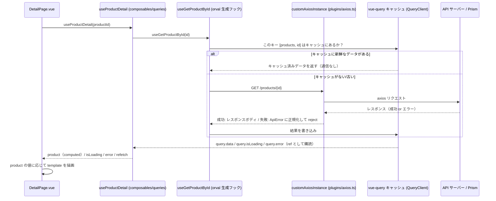
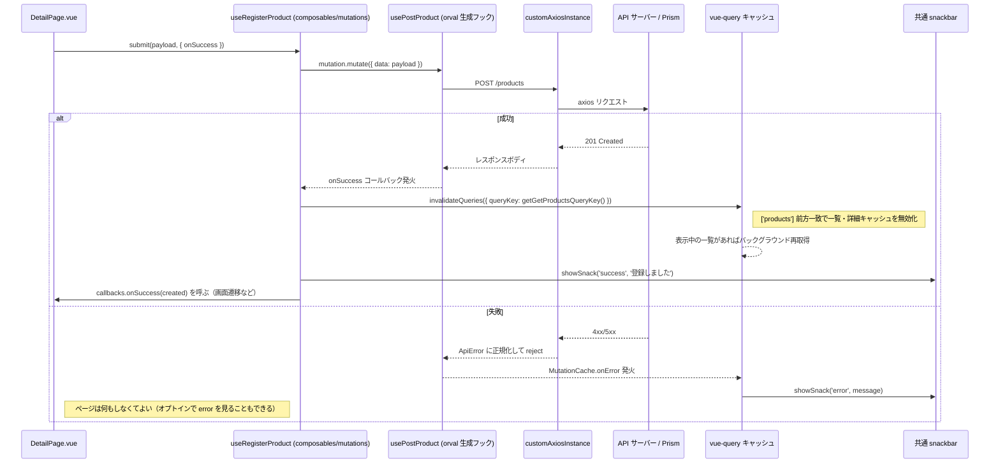

# 共通層の考え方とアーキテクチャ

このドキュメントは「なぜ共通層がこの形になっているか」を説明します。
ページを実際にどう書くかは [チーム製造ガイド](./team-guide.md) を参照してください。こちらは背景・設計意図の資料です。

読者は vue-query（TanStack Query の Vue 版。サーバーから取得したデータのキャッシュ・再取得・更新を
まとめて管理するライブラリ）や Pinia（クライアント側の状態管理ライブラリ）をほとんど知らない前提で書いています。

---

## 目次

1. [全体レイヤー図](#全体レイヤー図)
2. [データフロー: 取得系](#データフロー-取得系)
3. [データフロー: 更新系](#データフロー-更新系)
4. [エラー処理3段構え](#エラー処理3段構え)
5. [vue-query の考え方の入門解説](#vue-query-の考え方の入門解説)
6. [サーバー状態とクライアント状態を分ける考え方](#サーバー状態とクライアント状態を分ける考え方)
7. [設計判断の記録](#設計判断の記録)
8. [関連資料](#関連資料)

---

## 全体レイヤー図

```
openapi/api.yaml  ─── npm run orval ───▶  orval 生成物（手編集禁止）
                                            ├── src/api/index.ts      … vue-query フック（useGetXxx / usePostXxx）
                                            ├── src/api/index.zod.ts  … zod スキーマ（実行時検証用）
                                            └── src/types/api/*.ts    … TypeScript 型（Product, GetProductsParams 等）
                                                        │
                                                        ▼
                              src/composables/
                                ├── queries/    … 取得系。1エンドポイント = 1ファイル
                                │                  （useMenu / useProductList / useProductDetail）
                                └── mutations/  … 更新系。1操作 = 1ファイル
                                                   （useRegisterProduct）
                                                        │
                              src/stores/ (Pinia) ◀─────┤  ※サーバーデータは置かない。クライアント状態のみ
                                （settingsStore / themeStore / memoStore 等）
                                                        │
                                                        ▼
                              src/pages/ , src/components/
                                （import してよいのは composables/stores の useXxx() と
                                  @/types の型だけ。@/api・vue-query・axios の直接 import は ESLint エラー）
                                                        │
                                                        ▼
                              src/composables/useSnackbar.ts + グローバル snackbar UI
                                （QueryCache/MutationCache の onError から共通で呼ばれる）
```

補助的な位置づけとして、以下の2つの薄い層が共通層を裏で支えています。

- `src/plugins/axios.ts` … 全 HTTP 通信の入口。エラーを `ApiError` に正規化する（後述）。
- `src/plugins/vueQuery.ts` … アプリ全体の `QueryClient` を1箇所で定義する。`staleTime` などの
  デフォルト方針とグローバルエラー通知（snackbar）をここに集約する。

ページ製造メンバーに伝えるルールは2行です（再掲、詳細は [team-guide.md](./team-guide.md)）:

> **処理は `@/composables/**`・`@/stores/**` の `useXxx()`、型は `@/types/**` から。**
> **`@/api`・`@tanstack/vue-query`・`axios` を直接 import したら ESLint エラー。**

---

## データフロー: 取得系

ページ表示から画面にデータが出るまでのシーケンス（`DetailPage.vue` → `useProductDetail` の例）。



ポイント:

- ページは `useProductDetail(productId)` を呼ぶだけで、通信するかキャッシュから返すかを意識しません。
- `productId` が `computed` の場合、値が変わると自動的にこのシーケンスが再実行されます
  （「[vue-query の考え方の入門解説](#vue-query-の考え方の入門解説)」参照）。
- API がエラーを返した場合、`useProductDetail` はモック JSON から同 id の商品を探してフォールバック表示します
  （`query.isError` を見て切り替え）。これは composable 内で完結しており、ページは意識しません。

---

## データフロー: 更新系

登録ボタンを押してから一覧が更新されるまでのシーケンス（`DetailPage.vue` → `useRegisterProduct` の例）。



ポイント:

- 「成功したら何をするか」だけがページ固有（`onSuccess` コールバック）。
  「キャッシュ無効化」「成功/失敗 snackbar」は composable / グローバル層が担当し、全ページ共通です。
- 一覧キャッシュの無効化は `getGetProductsQueryKey()`（引数なし = `['products']`）に対して行うため、
  ページング・検索条件違いの `['products', {page:2, ...}]` なども含めて前方一致で無効化されます。

---

## エラー処理3段構え

```
┌─────────────────────────────────────────────────────────────────┐
│ 1. axios インターセプタ（src/plugins/axios.ts）                    │
│    全エラーを ApiError { message, status } に正規化する            │
│    → 呼び出し側は axios の内部構造（response.data.message 等）を   │
│      知らなくてよい                                                │
└───────────────────────────┬─────────────────────────────────────┘
                             ▼
┌─────────────────────────────────────────────────────────────────┐
│ 2. グローバル QueryCache / MutationCache の onError                │
│    （src/plugins/vueQuery.ts）                                    │
│    両方: ApiError.message で snackbar                            │
│    ※フォールバック文言: 取得系 'データの取得に失敗しました'          │
│      更新系 '処理に失敗しました'                                  │
│    → 何もしなくても失敗はユーザーに通知される                        │
└───────────────────────────┬─────────────────────────────────────┘
                             ▼
┌─────────────────────────────────────────────────────────────────┐
│ 3. ページの error（オプトイン）                                     │
│    composable が返す error を見て画面固有の対応をしたい場合だけ使う   │
│    （フィールド下のエラー表示・リトライボタン・フォールバック表示等）  │
│    → 何もしなければ 2 で完結する。ページは try/catch を書かない      │
└─────────────────────────────────────────────────────────────────┘
```

各層の責務と実体:

| 層 | ファイル | 責務 |
|---|---|---|
| 1. axios 正規化 | `src/plugins/axios.ts`（`toApiError` は `src/api/apiError.ts`） | `isAxiosError` で判定し、レスポンスの `message` フィールド（`ErrorResponse` スキーマ）を取り出して `ApiError` に詰め替える。レスポンスがない（接続不可）場合は「通信に失敗しました」に固定 |
| 2. グローバル snackbar | `src/plugins/vueQuery.ts`（`QueryCache`/`MutationCache` の `onError`） | `error instanceof ApiError` なら `error.message` を、そうでなければ汎用メッセージを `showSnack('error', ...)` で表示 |
| 3. ページのオプトイン | 各ページの `<script setup>` | composable が返す `error`（`Ref<ApiError | null>`）を参照するかどうかはページの自由 |

`src/api/apiError.ts` の実装:

```typescript
export class ApiError extends Error {
  status?: number
  constructor(message: string, status?: number, cause?: unknown) {
    super(message, { cause })
    this.name = 'ApiError'
    this.status = status
  }
}
```

この3段構えにより、「何もしなければ最低限のエラー通知が出る」状態を保証しつつ、
画面ごとに個別対応したい場合の拡張余地（第3層）も残しています。

---

## vue-query の考え方の入門解説

vue-query（TanStack Query）を知らない人向けに、このプロジェクトの文脈だけに絞って説明します。

### 何をしてくれるライブラリか

「API から取ってきたデータを画面に出す」という処理には、本来こういう手書きが必要です。

```typescript
// vue-query を使わない場合の手書き例（このプロジェクトでは書かない）
const data = ref(null)
const isLoading = ref(true)
onMounted(async () => {
  try {
    const res = await axios.get('/products/1')
    data.value = res.data
  } catch (e) {
    // エラー処理...
  } finally {
    isLoading.value = false
  }
})
```

これを毎回書くと、キャッシュなし（同じデータを何度も取りに行く）・エラー処理の書き漏れ・
ローディング状態の管理漏れが起きやすくなります。vue-query はこれを `useQuery` / `useMutation` という
共通の形にまとめてくれるライブラリです。orval がこの `useQuery` / `useMutation` の呼び出しを
openapi.yaml から自動生成してくれるので、このプロジェクトでは orval 生成フック（`useGetXxx` など）を
さらに composable でラップして使っています。

### queryKey（キャッシュのキー）

vue-query は取得したデータを「キー」ごとに記憶します。同じキーで呼べば通信せずキャッシュを返し、
違うキーなら新しく通信します。

```typescript
getGetProductsQueryKey()                              // → ['products']
getGetProductsQueryKey({ page: 1, pageSize: 5 })       // → ['products', { page: 1, pageSize: 5 }]
getGetProductByIdQueryKey(1)                           // → ['products', 1]
```

キーは配列なので「前方一致」でまとめて操作できます。`['products']` を対象に無効化すると、
`['products', 1]` や `['products', {page:2}]` など `'products'` から始まる全キーが対象になります。
これが更新系の「一覧・詳細キャッシュをまとめて無効化」の仕組みです。

このプロジェクトでは queryKey を手書きしません。orval が生成した `getGetXxxQueryKey()` を
そのまま使います（キーの書式を人間が揃える必要がなくなる）。

### キャッシュと staleTime

取得したデータは `QueryClient` という1つの箱（アプリ全体で共有）に溜まります。
`src/plugins/vueQuery.ts` でこの箱の方針を1箇所にまとめています。

```typescript
defaultOptions: {
  queries: {
    staleTime: 5 * 60 * 1000, // 5分: ページまたぎの再フェッチを抑制
    retry: 1,
    refetchOnWindowFocus: false,
  },
},
```

- **staleTime**（5分）: 取得してから5分間は「新鮮」とみなし、同じキーで再度呼ばれても再通信しません。
  一覧 → 詳細 → 一覧、と行き来してもすぐには再通信しない、という体感になります。
- **retry**（1）: 失敗したら1回だけ自動リトライします。
- **refetchOnWindowFocus**（false）: 別アプリから戻ってきても自動再取得しません
  （スマホアプリ想定で、意図しない通信を避けるため）。

### invalidate（キャッシュを無効化する）

「このキャッシュはもう古い」と vue-query に伝える操作です。更新系 composable の `onSuccess` で使います。

```typescript
await queryClient.invalidateQueries({ queryKey: getGetProductsQueryKey() })
```

無効化されたキーを表示中のページがあれば、裏側で自動的に再取得されます。ページ側で
「一覧をもう一度取得し直す」コードを書く必要はありません。

### このプロジェクトでの使いどころまとめ

| vue-query の概念 | このプロジェクトでの扱い |
|---|---|
| `useQuery` | 直接は使わない。orval 生成の `useGetXxx` → composable（`composables/queries`）でラップ |
| `useMutation` | 直接は使わない。orval 生成の `usePostXxx` → composable（`composables/mutations`）でラップ |
| queryKey | 手書きしない。orval 生成の `getGetXxxQueryKey()` を使う |
| staleTime / retry | ページごとに設定しない。`src/plugins/vueQuery.ts` で全体に1回だけ設定 |
| invalidateQueries | 更新系 composable の `onSuccess` の中だけで使う |

より詳しい状態機械やフラグの組み合わせ（`isLoading` と `isFetching` の違い等）は
[vue-query-architecture.md](../reference/vue-query-architecture.md) を参照してください
（vue-query 自体の一般的な解説。本ドキュメントはこのプロジェクトの共通層の文脈に絞っています）。

---

## サーバー状態とクライアント状態を分ける考え方

このプロジェクトでは「API から取ってきたデータ（サーバー状態）」を Pinia store に入れません。
`composables/queries` の vue-query キャッシュだけに置きます。

### なぜ分けるか

サーバー状態とクライアント状態は性質が違います。

| | サーバー状態（例: 商品一覧） | クライアント状態（例: テーマ設定） |
|---|---|---|
| データの所有者 | サーバー（自分はコピーを持っているだけ） | このアプリ自身 |
| 古くなるか | なる（他の人が更新するかもしれない） | ならない（自分が変えない限り変わらない） |
| 取得方法 | 非同期の通信が必要 | 同期的にメモリ/localStorage から読める |
| 重複排除・再取得・リトライ | 必要（vue-query が担当） | 不要 |

もし商品一覧を Pinia store に手書きで持つと、上記の「古くなる」「重複リクエストを防ぐ」「再取得する」
といった処理をすべて自分で実装し直すことになります。vue-query はまさにこれを解決するために作られたライブラリなので、
store に入れてしまうとその価値を失い、かつ store と vue-query キャッシュの二重管理（どちらが正か分からなくなる）
という問題が起きます。

### このプロジェクトでの実際の使い分け

```
vue-query（composables/queries）
  ├── useMenu()          → メインメニュー（API）
  ├── useProductList()   → 商品一覧（API）
  └── useProductDetail() → 商品詳細（API）

Pinia store（src/stores/）
  ├── memoStore     → 商品ごとのメモ（persist: true で localStorage 永続化）
  ├── settingsStore → アプリ設定（persist: true）
  ├── themeStore    → テーマ設定（persist: true）
  ├── scannerStore / scanListStore / scanModeStore → バーコードスキャナーのセッション状態（永続化なし）
  └── workSessionStore → 作業セッションのクライアント状態
```

判断基準を1行で言うと: **「サーバーに問い合わせないと分からない値」は composable、
「このアプリの中だけで完結する値」は store かページ内 `ref`**、です。
実務での判断表・判断フローは [チームガイドの「4. 状態を持ちたい（store か ref か）」](./team-guide.md) を参照してください。

---

## 設計判断の記録

以下は [共通層設計スペック](../superpowers/specs/2026-07-06-team-common-layer-design.md) の
「検討過程」を要約したものです。詳細な比較表は元スペックを参照してください。

### なぜドメイン composable を手書きするか（汎用ファクトリを作らない理由）

検討した選択肢は3つでした。

| 案 | 評価 |
|---|---|
| **A. ドメイン composable 層（採用）** — 1エンドポイント = 1ファイルで orval フックを手書きラップ | ◎ |
| B. 汎用ファクトリ層（`createAppQuery` のようなものを作り、設定を渡すだけで composable を生成する） | △ |
| C. ラップなし・規約ドキュメントのみ（ページから orval フックを直接呼ぶ） | △ |

採用した A の理由:

- 各ファイルが具体的で、vue-query や Pinia に詳しくないメンバーでも読める・デバッグできる。
- フォールバック処理（オフライン時のモック表示）・zod 実行時検証・データ整形など、
  エンドポイントごとに異なる個別ロジックの置き場所が composable 内に明確に決まる。
- orval を再生成しても、影響は composable 層で吸収され、ページまで波及しない。
- 欠点はエンドポイント追加ごとに1ファイルを手書きする必要があることだが、雛形コピペで数分の作業で済む。

B（汎用ファクトリ）を採らなかった理由: orval がすでに `useQuery`/`useMutation` 相当のコードを
生成しており、その上にさらに汎用ファクトリを重ねると二重の抽象化になる。型パズルが発生しやすく、
「vue-query をほぼ知らない」前提のメンバーがエラーメッセージを読めなくなるリスクが大きいと判断した。

C（ラップなし）を採らなかった理由: コード追加はゼロだが、「vue-query/Pinia をほぼ知らない」という
前提と矛盾する。個別ロジック（フォールバック処理等）がページごとに散らばり、書き方のブレを止められない。

### なぜ型を `src/types/api` に分離したか

orval のデフォルト設定では、生成される型は `src/api/index.ts` の中に同居します。しかしページ・
コンポーネントは `@/api` を一切 import してはいけないルールにしたため（ESLint で禁止）、
型だけを取り出す方法が必要でした。`orval.config.ts` の `output.schemas: './src/types/api'` を
指定することで、型定義の生成先を `src/api/` から分離し、`src/types/api/` に出力しています。
これにより、既存の `src/types/` という慣習と統一され、ページは `@/types/api` から型を import するだけで済み、
`@/api` に一切触れずに済みます。

### なぜ ESLint で import 制限するか

規約を守らせる方法として検討したのは2つです。

| 案 | 評価 |
|---|---|
| **雛形＋コピペガイド（本体・採用）** | ◎ |
| **ESLint import 制限（保険・採用）** | ◎ |
| CLAUDE.md への規約記載のみ | △ |

雛形＋コピペガイド（`docs/team-guide.md`）が本体である理由: 人はドキュメントの文章より、
隣にある動くコードをコピーする傾向が強い。「vue-query/Pinia をほぼ知らない」前提のチームでは、
正しい書き方を雛形として提示することが必須と判断した。

ESLint（`no-restricted-imports`）を保険として追加した理由: 雛形を無視して `@/api` や
`axios` を直接使ってしまった場合、レビューで気づかなくてもエラーとして即座に検出できる。
設定コストは10行程度と小さい。一方で、命名規則やファイル構成まで ESLint で縛る運用は
メンテコストに見合わないと判断し、スコープ外とした（CLAUDE.md への規約転記のみの案は、
AI 利用時にしか効かず機械的強制がないため不採用）。

### スコープ外として見送ったもの（YAGNI）

- 汎用ファクトリ（`createAppQuery` 等）— 上記の理由で二重抽象になるため作らない。
- ESLint による命名規則・ファイル構成の強制 — メンテコストに見合わない。
- 楽観的更新（optimistic update）— 必要になった画面で個別に設計する。
- CLAUDE.md への規約転記 — `team-guide.md` に一本化し、必要になれば参照リンクのみ追加する。
- 認証・オフライン永続化の強化 — 前提スペック（データ取得アーキテクチャ設計）のスコープ外を継続。

---

## 関連資料

- [チーム製造ガイド](./team-guide.md) — 実際にページを作るときの手順・雛形・FAQ
- [共通層設計スペック](../superpowers/specs/2026-07-06-team-common-layer-design.md) — この資料の元になった設計検討の全文（選択肢比較・変更対象一覧など）
- [2026-07-03-data-fetching-architecture-design.md](../superpowers/specs/2026-07-03-data-fetching-architecture-design.md) — 前提となるデータ取得アーキテクチャの設計スペック
- [vue-query-architecture.md](../reference/vue-query-architecture.md) — vue-query 自体の詳しい解説（QueryClient・QueryKey・状態機械・Q&A）
- [architecture.md](../design/architecture.md) — アプリ全体の技術スタック・レイヤー構成図・ディレクトリ構成
- [openapi-orval-vue-query.md](../archive/openapi-orval-vue-query.md) / [orval-zod-data-fetching-flow.md](./orval-zod-data-fetching-flow.md) — openapi.yaml 起点の orval 生成フロー
