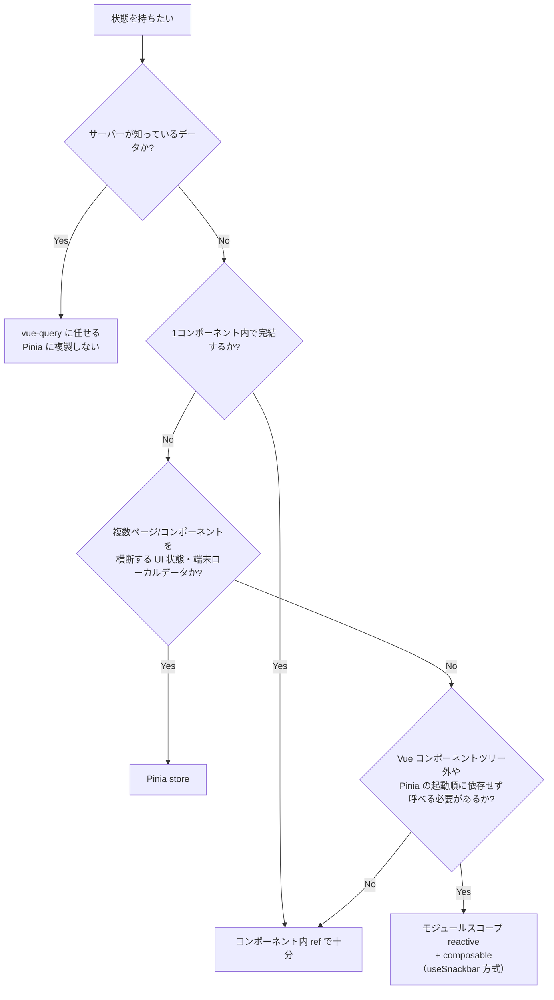

# Pinia store 設計ガイド — 何を単位に、どう state/getters/actions を作るか

「store は作ると決まった後」の設計論。store を作るべきかどうかの大前提（サーバーデータは vue-query が持ち、
Pinia は「サーバーが知らないデータ」だけを持つ）は
[vue-query-orval-zod-store-guide.md](./vue-query-orval-zod-store-guide.md) の「詳細③：Pinia は何を持つのか」に既にある。
本書はその前提を踏まえた上で、「では store 1個の境界はどこに引くのか」「state/getters/actions はどう書くのか」を
このリポジトリの実 store 7個から抽出する。「何がある store か」の一覧・仕様は
[store-definition.md](../../design/store-definition.md) を参照（本書と重複させない）。

---

## 目次

1. [結論：store は「関心事（機能）単位」](#1-結論store-は関心事機能単位)
2. [store を作る/作らないの判断フロー](#2-store-を作る作らないの判断フロー)
3. [state 設計](#3-state-設計)
4. [actions 設計](#4-actions-設計)
5. [getters(computed) 設計](#5-getterscomputed-設計)
6. [テスト](#6-テスト)
7. [新しい store を作るときのチェックリスト＋雛形](#7-新しい-store-を作るときのチェックリストひな形)

---

## 1. 結論：store は「関心事（機能）単位」

このリポジトリの `src/stores/` には現在 7 store あるが、**どれもコンポーネント単位でもページ単位でもない**。
1つの store が複数のページ・複数のコンポーネントから使われ、逆に1つのページが複数の store を使う。
単位になっているのは「ユーザーから見て1つのまとまった関心事」だけである。

| store | ファイル | 関心事（何をまとめているか） | persist | 実際の呼び出し元（複数） |
|---|---|---|---|---|
| `menuStore` | `src/stores/menuStore.ts` | ナビメニューの表示/非表示・並び順 | ✓ | `MenuGrid.vue`（表示）／`MenuSettingsPanel.vue`（編集） |
| `memoStore` | `src/stores/memoStore.ts` | 商品メモ（productId → text） | ✓ | `ProductCard.vue`（一覧の既読バッジ）／`DetailPage.vue`（編集） |
| `settingsStore` | `src/stores/settingsStore.ts` | アプリ設定（エラー履歴保持件数など） | ✓ | `SettingsPage.vue` ほか設定値を参照する各所 |
| `themeStore` | `src/stores/themeStore.ts` | 選択中テーマ | ✓ | `SettingsThemePanel.vue`、`App.vue` |
| `scannerStore` | `src/stores/scannerStore.ts` | 単発バーコードスキャンのページ間ハンドオフ | × | `BarcodeInputField.vue`（起動・結果消費）／`ScannerPage.vue`（完了通知） |
| `scanListStore` | `src/stores/scanListStore.ts` | 複数件スキャンリストのページ間ハンドオフ | × | 起動元の各ページ／`ScanListPage.vue` |
| `scanModeStore` | `src/stores/scanModeStore.ts` | スキャンモード選択のページ間ハンドオフ | × | 起動元の各ページ／`ScanModePage.vue` |

裏取り①: `memoStore`。「商品メモ」という1つの関心事を、**一覧カード（`ProductCard.vue`）と詳細ページ
（`DetailPage.vue`）という異なる粒度・異なるページの両方**が参照している。store がページ単位だったら
`DetailPage` 用の memo state が独立し、一覧側は同じデータを持てなかったはずである。

裏取り②: `scannerStore`／`scanListStore`／`scanModeStore`。「オプションを保存 → 別ページへ push →
完了/キャンセルで戻る」という**同じ形**をしているが、「単発スキャン」「複数件スキャンリスト」「モード選択」
という**関心事が違う**ため、1つの汎用 `scanStore` に統合していない。形が似ていても安易に統合しない、
というのも「関心事単位」の現れである。

> **参考（現状との差分）**: `docs/design/store-definition.md` には `product` / `mainMenu` / `workSession` という
> store も記載されているが、`src/stores/` には現在存在しない。git 履歴で確認できる削除理由:
> `product` / `menu` はサーバーデータの vue-query 一本化に伴い削除（コミット 72a0b5b「DetailPage を useGetProductById に移行し product ストアを削除」・b8e4b94「MainMenuPage を useGetMenu に移行し menu ストアを削除」）、
> `workSession` は保存層への移行で廃止（a98a775）。つまり「サーバーデータを store に持たない」原則が確立する過程で消えた store 群であり、本書の判断フローの実証例でもある。

---

## 2. store を作る/作らないの判断フロー



- **サーバーデータは Pinia 禁止** — 一覧・詳細などは vue-query。判断基準は前提ガイド側にある。
- **1コンポーネントで完結するなら ref** — 例: ダイアログの開閉、フォームの入力途中値など。
- **複数箇所で共有する UI 状態・端末ローカルデータなら store** — 本書が扱う本題。7 store は全てここに属する。
- **横断ユーティリティは「store にしない」選択肢もある** — `src/composables/useSnackbar.ts` が実例:

```typescript
// src/composables/useSnackbar.ts
const state = reactive<{ show: boolean; color: SnackColor; text: string; icon: IconType }>({ ... })

export function useSnackbar() {
  function showSnack(color: SnackColor, text: string) { ... }
  return { state, showSnack }
}
```

Snackbar の表示状態は複数コンポーネントから使われる（`AppSnackbar.vue` が表示、各ページ/mutation が発火）ので
「store 候補」に見えるが、実際は Pinia store にしていない。理由は呼び出し元にある。
`src/plugins/vueQuery.ts` の `createAppQueryClient()` は `app.use(pinia)` 前後の**プラグイン登録処理の中**で
`useSnackbar()` を呼んで `QueryCache`/`MutationCache` の `onError` に渡している。`useXxxStore()` は
`getActivePinia()` が存在しないと動かないため、Pinia のインストール順に依存させたくないこの箇所では使えない。
モジュールスコープの `reactive` はコンポーネントツリーにも Pinia のライフサイクルにも依存しないため、
「いつどこから呼ばれても安全」という制約を満たすためにあえて store にしていない。

もう一つの「store でない状態共有」が `src/composables/useScanSetProgress.ts`。こちらは Pinia にすらせず、
呼び出しごとに独立した状態を返す**素の composable**（呼ぶたびに新しい `ref`/`computed` インスタンスを返す）。
スキャンセット1件分の進行状態は「複数ページで共有」ではなく「1つの実行コンテキストに閉じたロジック」なので、
store 化する理由がない。

---

## 3. state 設計

### 3.1 全 store が setup store 記法

7 store すべてが `defineStore('id', () => { ... return {...} })` という **setup store** 記法で書かれている
（Options API の `state()/getters/actions` 形式は1つもない）。「state は `ref`、getters は `computed`、
actions は関数」という書き方が、ページ側 composable（`useMenu.ts` 等）と統一されている。

### 3.2 最小の state + 派生は computed

`menuStore` が最も分かりやすい。**永続化して持つべき最小の値は `visibleIds: string[]` の1つだけ**で、
実際に画面が使う `visibleItems` / `hiddenItems` / `canAddMore` はすべて `computed` による派生値である
（詳細は [5. getters 設計](#5-getterscomputed-設計)）。「保存すべき最小の事実」と「それから作れる値」を
分けるのが基本形。

### 3.3 `Record<id, value>` でサーバーデータと id 結合するパターン

`memoStore` の `memos: Record<number, string>`（`productId → text`）が実例。サーバーデータ本体
（`Product`）は持たず、id をキーにした `Record` だけを持つ。コンポーネント側は vue-query から取った商品
データと、この id をその場で `computed` で結合する（前提ガイドの「詳細③」参照）。`memos` はサーバーの商品が
増減しても壊れない ── 「サーバーデータをコピーしない」方針の state 設計版である（id で引く関数の形は
5.2 節を参照）。

### 3.4 persist を付ける基準

7 store を persist の有無で分けると、きれいに二分される。

| persist ✓（端末に残したい） | persist ×（残したくない） |
|---|---|
| `menuStore`（ユーザーがカスタマイズしたメニュー配置） | `scannerStore`（1回のスキャン往復だけで使い捨てる） |
| `memoStore`（ユーザーが書いたメモ） | `scanListStore`（同上） |
| `settingsStore`（ユーザー設定） | `scanModeStore`（同上） |
| `themeStore`（選んだテーマ） | |

分岐点は「**アプリを閉じて再度開いたときに覚えていてほしいか**」。persist ✓ 側は全部「ユーザーが能動的に
選択・入力した値」。persist × 側は全部「ページ A → ページ B への一時的な受け渡し用の state」で、
遷移が終われば `complete()`/`cancel()` で `null` に戻るライフサイクルの短い値である（4.2 節参照）。

---

## 4. actions 設計

### 4.1 命名：動詞 + ガード条件は action の中に置く

`menuStore.addToVisible` が典型例。呼び出し側（`MenuSettingsPanel.vue`）は上限チェックを一切書かず、
`store.addToVisible(id)` を呼ぶだけで済む。

```typescript
// src/stores/menuStore.ts
const canAddMore = computed(() => visibleIds.value.length < 9)

function addToVisible(id: string) {
  if (!canAddMore.value || visibleIds.value.includes(id)) return
  visibleIds.value = [...visibleIds.value, id]
}
```

「9件まで」「重複禁止」という業務ルールが store 内に閉じており、UI 側（`v-switch` の `:disabled`）は
`store.canAddMore` を**表示の制御にだけ**使う。UI 側の disabled 制御が万一漏れても action がガードするため
二重に安全 ── これが「state 直接変更をコンポーネントにさせず action 経由にする」ことの実利益である。

### 4.2 ページ間ハンドオフの3点セット: `request→complete/cancel`

`scannerStore` / `scanListStore` / `scanModeStore` の3つは、独立した store でありながら**同じ action 命名
規約**に揃っている。

| action | 役割 |
|---|---|
| `request*(opts, callback)` | 起動元がオプションとコールバックを渡す → state に保存 → 遷移先へ `router.push` |
| `complete(result)` | 遷移先が結果を確定 → 保存しておいたコールバックを呼ぶ → state をクリア → `router.back()` |
| `cancel()` | コールバックを呼ばずに state をクリア → `router.back()` |

```typescript
// src/stores/scanListStore.ts
function requestScanList(opts: ScanListOptions) {
  options.value = opts
  router.push('/scan-list')
}
function complete(items: ScanListItem[]) {
  options.value?.onConfirm(items)  // 保存しておいたコールバックを呼ぶ
  options.value = null
  router.back()
}
```

router 遷移そのものを store の action に持たせている点も一貫している。呼び出し側は「呼ぶだけ」で、
画面遷移のタイミングや戻り方（`push` か `back` か）を意識しなくてよい。3 store はコピー&ペーストではなく
関心事ごとに別ファイルとして書かれているが、規約は横展開されている（新しい「ページ間ハンドオフ store」を
作るときはこの3点セットに合わせるとよい）。

### 4.3 イミュータブル更新 vs 直接 mutate の実際

このリポジトリでは統一されておらず、**データ形状ごとに書き分けられている**。

```typescript
// menuStore: 配列は再代入（スプレッド/filter で新配列を作って .value に代入）
visibleIds.value = [...visibleIds.value, id]              // 追加
visibleIds.value = visibleIds.value.filter(v => v !== id) // 削除

// memoStore: Record はキーへの直接代入
memos.value[productId] = text
```

どちらも Vue のリアクティビティ上は問題なく検知される。配列側が再代入なのは「表示順」という配列全体の
アイデンティティが意味を持つため（`reorder(newIds)` で丸ごと差し替える設計と統一感がある）。`Record` 側は
「1エントリだけ更新する」操作が本質であり、丸ごと差し替えるメリットがない。「配列は不変更新、オブジェクトは
直接更新」という機械的ルールというより、**「その action が意味的に何を変更しているか」に合わせて書き方を
選んでいる**、と理解するのがよい。

---

## 5. getters(computed) 設計

### 5.1 フィルタ・件数は store 側に置く

`menuStore` の `visibleItems` / `hiddenItems` が実例。「表示する項目」「非表示の項目（追加候補）」という
導出はコンポーネント側で `v-for` の中で毎回計算するのではなく、store の `computed` として一元化されている。

```typescript
// src/stores/menuStore.ts
const visibleItems = computed(() =>
  visibleIds.value.map(id => MENU_MASTER.find(m => m.id === id)).filter((m): m is MenuItem => m !== undefined)
)
const hiddenItems = computed(() => MENU_MASTER.filter(m => !visibleIds.value.includes(m.id)))
```

判断基準: **2箇所以上のコンポーネントが同じ導出ロジックを必要とするなら store の computed に上げる**。
実際 `visibleItems` は `MenuGrid.vue`（表示用）と `MenuSettingsPanel.vue`（編集用）の両方が参照しており、
コンポーネントごとに再実装していない。

### 5.2 パラメータ付きの「getter」は computed ではなく関数になる

`memoStore` には `computed` が1つもない。`getMemo(productId)` / `hasMemo(productId)` は plain な関数として
定義されている。

```typescript
// src/stores/memoStore.ts
function getMemo(productId: number): string { return memos.value[productId] ?? '' }
function hasMemo(productId: number): boolean { return !!memos.value[productId]?.trim() }
```

Vue の `computed` は引数を取れない（＝呼び出しごとに異なる id で評価し分けられない）ため、
「id を渡して値を引く」形の派生ロジックは自然と関数になる。setup store では「getters = 必ず computed」
ではなく、**引数なしの派生値は computed、引数ありの派生値は関数**という書き分けが実態である。

---

## 6. テスト

### 6.1 `setActivePinia` はグローバル設定済み — 各テストファイルは書かない

`src/test/setup.ts` の `beforeEach` が毎回 `setActivePinia(createPinia())` を実行してから各テストを走らせる。
そのため `memoStore.test.ts` など個々の store テストは `setActivePinia(createPinia())` を**自分では呼ばず**、
`const store = useMemoStore()` からいきなり書き始められる（`src/stores/__tests__/memoStore.test.ts`）。

### 6.2 persist プラグインはテスト環境に登録されていない

`src/test/setup.ts` の `createPinia()` には `pinia-plugin-persistedstate` が `.use()` されていない
（本番用の登録は `src/plugins/index.ts` の `registerPlugins()` 側だけ）。つまり `persist: true` が付いている
store（`memoStore` 等）もテスト内では**ただのメモリ上 store**として振る舞う。localStorage のモックや
persist 自体の動作検証は行われておらず、テストは store のロジック（action/getter）だけを対象にしている。

### 6.3 `router` に依存する store は `vi.mock` で差し替える

`scanListStore` / `scanModeStore` は action 内で `router.push` / `router.back()` を直接呼ぶため、テストは
`vi.mock('@/router', () => ({ default: { push: vi.fn(), back: vi.fn() } }))` で差し替えてから呼び出しを検証する
（`src/stores/__tests__/scanListStore.test.ts`）。「呼ばれたコールバックの中身」「state がクリアされること」
「router が呼ばれたこと」の3点を毎回セットで検証しており、4.2 節の action 規約とそのまま対応している。

### 6.4 境界値・空文字は明示的にテストする

`memoStore.test.ts` は「空白のみのメモは false」「空文字にするとメモが消える」という、`hasMemo` の
`.trim()` 挙動に対するケースを個別に持つ。getters/actions に条件分岐を入れたら、その境界をテストに残す、
という粒度がこのリポジトリの水準になっている。

---

## 7. 新しい store を作るときのチェックリスト＋雛形

作る前に確認すること:

- [ ] サーバーが知っているデータではないか？（Yes なら vue-query。1節・前提ガイド参照）
- [ ] 1コンポーネントで完結しないか？（Yes なら store 不要、ref で十分）
- [ ] Pinia のライフサイクル外（プラグイン登録処理など）から呼ぶ必要はないか？（Yes なら `useSnackbar.ts`
      方式のモジュールスコープ `reactive` を検討）
- [ ] 既存 store と関心事が重複していないか？（似た形でも関心事が違うなら分けてよい。4.2 節参照）
- [ ] アプリ再起動後も覚えていてほしい値か？（Yes なら `persist: true`）
- [ ] 業務ルール（上限・重複禁止など）はコンポーネントではなく action 内に書けているか？
- [ ] パラメータなしの派生値は `computed`、パラメータありは関数、と書き分けたか？（5節参照）

雛形（実 store のスタイルに準拠。persist 不要な UI 状態向け、必要なら `persist: true` を付ける）:

```typescript
// src/stores/xxxStore.ts
import { defineStore } from 'pinia'
import { ref, computed } from 'vue'

export const useXxxStore = defineStore('xxx', () => {
  // --- state: 保存すべき最小の事実だけを持つ ---
  const value = ref<string>('')

  // --- getters: パラメータなしの派生値は computed ---
  const isEmpty = computed(() => value.value.trim().length === 0)

  // --- actions: 動詞で命名し、ガード条件は action 内に置く ---
  function setValue(next: string) {
    value.value = next
  }

  return { value, isEmpty, setValue }
}, {
  persist: true, // 端末に残したい場合のみ付ける。手書き localStorage は禁止（team-guide.md 参照）
})
```
