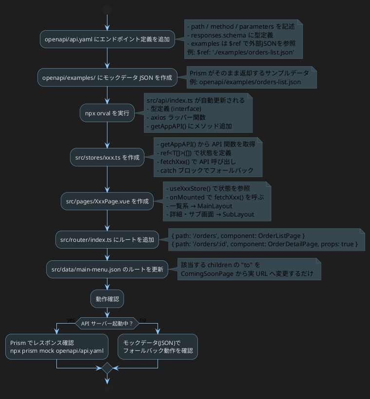

# 新規ページ作成フロー

## フローチャート



## 手順サマリー

| # | 作業対象 | 内容 |
|---|---------|------|
| 1 | `openapi/api.yaml` | エンドポイント・型・examples の定義 |
| 2 | `openapi/examples/xxx.json` | Prism 用モックレスポンスデータ |
| 3 | `npx orval` | 型定義 + axios 関数を自動生成 |
| 4 | `src/stores/xxx.ts` | Pinia store（API 呼び出し＋状態） |
| 5 | `src/pages/XxxPage.vue` | 画面コンポーネント |
| 6 | `src/router/index.ts` | ルート登録 |
| 7 | `src/data/main-menu.json` | メニュー導線の有効化 |

## 依存関係

```
openapi/api.yaml
  └─ npx orval
       └─ src/api/index.ts   ← 型定義 + getAppAPI()
            └─ src/stores/xxx.ts   ← 状態管理・API 呼び出し
                 └─ src/pages/XxxPage.vue   ← 表示
                      ├─ src/router/index.ts   ← ルーティング
                      └─ src/data/main-menu.json   ← メニュー導線
```

## Prism モックサーバー起動

```bash
npx prism mock openapi/api.yaml --port 4010
```

`src/plugins/axios.ts` の `baseURL` が `http://localhost:4010` を向いているため、
Prism 起動中は実 API レスポンスを返す。未起動時はフォールバック JSON を使用。
