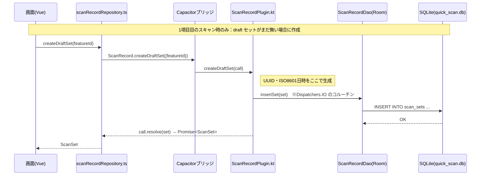
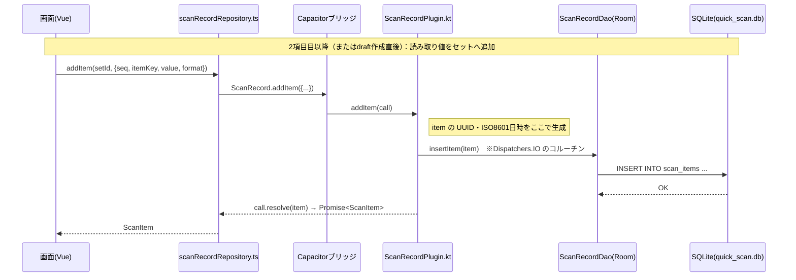
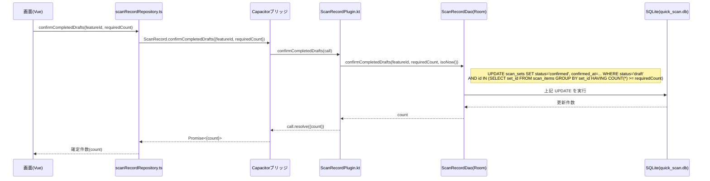
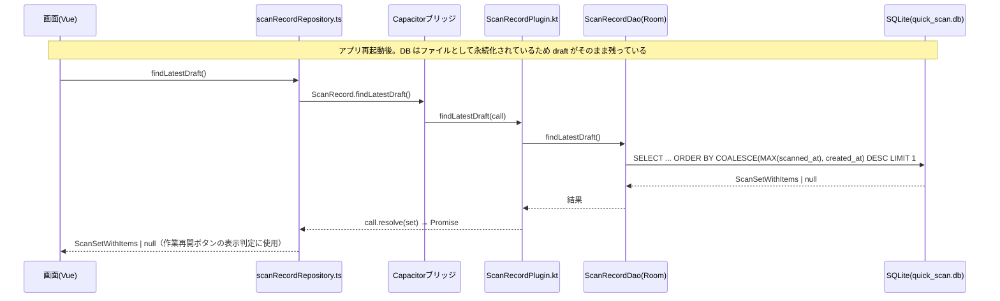
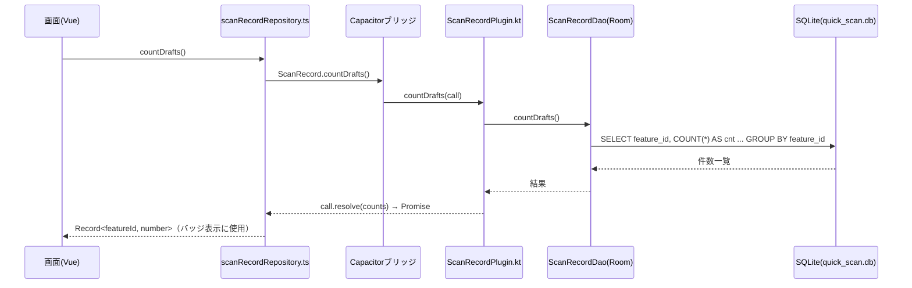
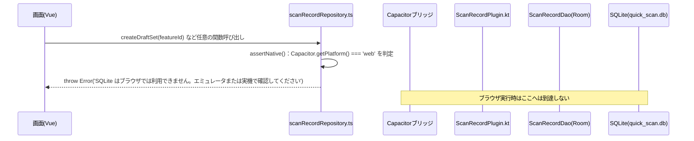
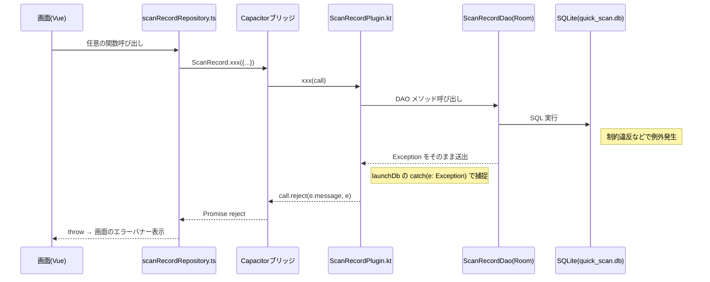

# SQLite 操作ガイド（クイックスキャンのローカルDB・Room 版）

**対象**: Kotlin + Room によるオフラインデータ保持の仕組み・操作方法・中身の確認方法
**関連実装**: `src/db/scanRecordRepository.ts` / `src/plugins/scanRecord.ts` / `android/app/src/main/java/com/example/myapp/db/`
**設計書**: `docs/superpowers/specs/2026-07-08-room-migration-design.md`

---

## 1. 全体像

```
画面 (QuickScanWorkPage など)
  ↓ 関数呼び出しのみ（SQL は書かない）
src/db/scanRecordRepository.ts   ← シグネチャ不変の薄いラッパー（プラグイン呼び出しのみ）
  ↓ Capacitor ブリッジ
src/plugins/scanRecord.ts        ← registerPlugin('ScanRecord') と型定義
  ↓
android/.../ScanRecordPlugin.kt  ← JSON ⇔ Kotlin 変換・ID/日時の生成・resolve/reject
  ↓
android/.../ScanRecordDao.kt     ← 業務クエリ（Room DAO・SQL はここに集約）
  ↓
AppDatabase.kt（Room）→ /data/data/com.example.myapp/databases/quick_scan.db
```

- **ブラウザ（`npm run dev`）では動かない**。`scanRecordRepository.ts` の各関数が入口で `Capacitor.getPlatform() === 'web'` を判定し、`SQLite はブラウザでは利用できません。エミュレータまたは実機で確認してください` を throw する。動作確認はエミュレータ/実機で行う
- SQL・スキーマ定義・ID（UUID）/日時（ISO 8601）の生成は**すべてネイティブ側の責務**。TS 側は文字列も日時も生成しない
- 旧 TS 実装（`@capacitor-community/sqlite` ・ `sqliteClient.ts` ・ `types.ts`）は撤去済み。旧 DB ファイル `quick_scanSQLite.db` は移行されず放置されている（新 DB は別名 `quick_scan.db`）。旧ファイルはアプリのデータ消去（またはアンインストール）まで端末に残り続ける

### レイヤーの責務

| ファイル | 責務 | 触ってよい人 |
|---|---|---|
| `src/db/scanRecordRepository.ts` | 業務関数8個。プラグイン呼び出しの薄いラッパー（SQL は書かない） | 画面から呼ばれる入口。関数追加時のみ |
| `src/plugins/scanRecord.ts` | `registerPlugin<ScanRecordPlugin>('ScanRecord')` と型定義 | プラグインにメソッドを足したとき |
| `android/.../ScanRecordPlugin.kt` | Capacitor ブリッジ。JSON ⇔ Kotlin 変換、UUID/ISO8601 生成、コルーチンで DAO 呼び出し | プラグインメソッド追加時 |
| `android/.../db/ScanRecordDao.kt` | Room DAO。全 SQL はここに集約 | クエリ追加・変更時 |
| `android/.../db/AppDatabase.kt` | `@Database` シングルトン（DB名 `quick_scan.db`、バージョン管理） | スキーマ変更時 |
| 画面・composable | repository の関数を呼ぶだけ | SQL 直書き禁止 |

---

## 2. テーブル定義

```sql
scan_sets (                          -- 1セット = 1〜3個の読み取り値のまとまり
  id           TEXT PRIMARY KEY,     -- UUID（ネイティブ側で生成）
  feature_id   TEXT NOT NULL,        -- 'inbound' | 'outbound' | 'inspection'
  status       TEXT NOT NULL,        -- 'draft'(作業中) | 'confirmed'(確定済み)  ※将来 'synced'
  created_at   TEXT NOT NULL,        -- ISO 8601
  confirmed_at TEXT                  -- 確定時刻。draft は NULL
)
-- index: (feature_id, status)

scan_items (                         -- セット内の各読み取り値
  id         TEXT PRIMARY KEY,
  set_id     TEXT NOT NULL,          -- scan_sets.id への外部キー（ON DELETE CASCADE）
  seq        INTEGER NOT NULL,       -- 1〜3。読み取り順
  item_key   TEXT NOT NULL,          -- 'part_no' | 'lot' | 'qty'
  value      TEXT NOT NULL,          -- 読み取り生値
  format     TEXT NOT NULL,          -- 'EAN_13' | 'QR_CODE' | 'MOCK' など
  scanned_at TEXT NOT NULL
)
-- index: (set_id)
```

Room 移行での追加点（旧 TS 実装からの改善）:

- `scan_items.set_id` に `scan_sets.id` への外部キー制約（`ON DELETE CASCADE`）を追加。`ScanSetEntity` 削除時に items が自動的にまとめて消える
- `scan_sets(feature_id, status)` / `scan_items(set_id)` に index を追加
- `deleteSet` / `clearDrafts` はいずれも DELETE 1文で CASCADE により items も同一ステートメントで消えるため、旧実装で課題だった「非トランザクション」の問題が解消されている

### status のライフサイクル

```
スキャン1項目目 → draft の set + item を INSERT（以降スキャンごとに item INSERT）
確定ボタン     → 完成セット（items が定義項目数に達したもの）のみ status='confirmed'
                 ※削除ではなく更新。confirmed が将来のサーバー送信キューになる
×/クリア      → draft のみ DELETE（confirmed は消えない。CASCADE で items も削除）
```

---

## 3. コードからの操作方法

画面からは従来どおり `scanRecordRepository` の8関数を使う。SQL は画面にもこのファイルにも書かない（SQL は `ScanRecordDao.kt` に集約）。

```ts
import {
  createDraftSet,          // (featureId) => ScanSet                             draft セット作成
  addItem,                 // (setId, {seq,itemKey,value,format}) => ScanItem
  deleteSet,               // (setId) => void                                    セット1件削除（CASCADEでitemsも消える）
  clearDrafts,             // (featureId) => void                                その機能の draft 全削除
  confirmCompletedDrafts,  // (featureId, requiredCount) => 確定件数
  findDraftSets,           // (featureId) => ScanSetWithItems[]                  created_at昇順・items seq昇順
  countDrafts,             // () => Record<featureId, number>                    バッジ用
  findLatestDraft,         // () => ScanSetWithItems | null                      作業再開ボタン用（直近更新）
} from '@/db/scanRecordRepository'
```

関数のシグネチャは旧 TS 直叩き実装から**不変**。中身は Capacitor プラグイン (`ScanRecord`) を呼ぶだけの薄いラッパーになっている。

### 新しい操作・テーブルを追加するとき（4点セット）

1. **`ScanRecordDao.kt`** に `@Query`（または `@Insert` / `@Transaction`）でメソッドを追加。SQL の列名・構文は KSP（Room アノテーション処理）が**コンパイル時に検証**するため、列名ミスはビルドエラーになる
2. **`ScanRecordPlugin.kt`** に `@PluginMethod` を追加し、DAO を呼んで結果を JSObject にして resolve
3. **`src/plugins/scanRecord.ts`** の `ScanRecordPlugin` インターフェースに対応するメソッド型を追加
4. **`src/db/scanRecordRepository.ts`** にプラグイン呼び出しの関数を追加

テーブル自体を追加・変更する場合はさらに:

- `@Entity` を新規作成 or 既存の列を変更し、`AppDatabase.kt` の `@Database(entities = [...])` に登録
- スキーマを変更したら **`@Database(version = ...)` を上げて `Migration` を書く**（§7 参照）

TS 側のテストは `src/db/__tests__/scanRecordRepository.test.ts` が見本。`@/plugins/scanRecord` を `vi.mock` し、repository の関数が正しいメソッド・引数でプラグインを呼び、戻り値をそのまま返すことを検証する（SQL 自体の正しさの検証責務はネイティブ側の DAO テストに移った）。

---

## 4. 処理フロー（シーケンス図）

### 概要

画面(Vue)からの呼び出しは `scanRecordRepository.ts` → Capacitor ブリッジ（`src/plugins/scanRecord.ts` の `registerPlugin`）→ `ScanRecordPlugin.kt` → `ScanRecordDao.kt`（Room）→ SQLite（`quick_scan.db`）の順に通る。ネイティブ側はすべて Kotlin のコルーチン（`Dispatchers.IO`）で DAO を呼び出す非同期処理で、完了後に `call.resolve()` を呼ぶことで JS 側の `Promise` が resolve される。エラーはブラウザ実行時は `scanRecordRepository.ts` の入口で即座に throw され（ネイティブ層には到達しない）、ネイティブ側の例外は `call.reject()` → JS 側で `Promise` reject → 画面側のエラーハンドリング（エラーバナー表示）という経路で戻る。

### 4-1. スキャン1件の保存（draft セット作成 + アイテム追加）

1項目目のスキャン時は `createDraftSet` で draft セットを作成してから `addItem` を呼ぶ。2項目目以降は既存の `setId` に対して `addItem` のみを呼ぶ。





### 4-2. 確定操作（confirmCompletedDrafts）

完成セット（items が定義項目数 `requiredCount` に達したもの）だけを `HAVING COUNT(*) >= requiredCount` で絞り込み、`status='confirmed'` に UPDATE する。削除ではなく更新であり、確定件数が戻り値として返る。



### 4-3. 作業再開（アプリ再起動後）

SQLite はファイルとして端末に永続化されるため、アプリを再起動しても draft データはそのまま残る。作業再開ボタンの表示判定には `findLatestDraft`、機能ごとのバッジ表示には `countDrafts` を使う。





### 4-4. エラー経路

(a) ブラウザ実行時は `scanRecordRepository.ts` の入口（`assertNative()`）で即座に throw し、Capacitor ブリッジより先には到達しない。



(b) ネイティブ側で例外（制約違反など）が起きた場合は `call.reject()` → JS 側で `Promise` reject → 画面のエラーバナー表示という経路で戻る。



---

## 5. 中身を見る方法

### 5-1. Android 実機 — Database Inspector【リアルタイム】

Android Studio でアプリをデバッグ実行 → View → Tool Windows → **App Inspection** → Database Inspector。
`quick_scan.db` のテーブルが live 表示され、クエリ実行・値の編集もできる。

### 5-2. Android 実機のファイルを吸い出して A5M2 / DB Browser で見る

```powershell
adb exec-out run-as com.example.myapp cat databases/quick_scan.db > quick_scan.db
```

あとは A5:SQL Mk-2（データベースの追加と削除 → SQLite）や DB Browser for SQLite で開く。

### 注意

- 5-2 で取り出したファイルは**その時点のスナップショット**。ツール上で編集してもアプリには反映されない（読み取り専用の確認用と割り切る）
- リアルタイムに見たいなら 5-1

---

## 6. データのリセット方法

| 環境 | 方法 |
|---|---|
| Android | 設定 → アプリ → アプリ情報 → ストレージ → データを消去 |
| コードから | `clearDrafts(featureId)` は draft のみ。全消しの関数は現状なし（必要になったら repository〜DAO に4点セットで追加） |

---

## 7. ハマりどころ（実際に踏んだもの・踏みやすいもの）

### ローカルプラグインは MainActivity での登録が必須

`ScanRecordPlugin` はアプリ内ローカルプラグインのため自動登録されない。`MainActivity.java` の `onCreate` で `super.onCreate()` より前に `registerPlugin(ScanRecordPlugin.class)` を呼ぶ必要がある（`SampleSdkPlugin` と同じパターン）。登録を忘れると JS 側で "not implemented" エラーになる。

### `@Relation` は items の並び順を保証しない

`ScanSetWithItems`（`@Embedded` set + `@Relation` items）で items を取得しても順序は保証されない。`ScanRecordPlugin.kt` の `toJs()` 拡張関数側で `items.sortedBy { it.seq }` によって seq 昇順に並べ替えている。DAO 層だけを見て「順序は SQL 側で担保されているはず」と誤解しないこと。

### スキーマ変更時は version を上げて Migration を書く

`AppDatabase.kt` の `@Database(version = 1, ...)` はスキーマ変更のたびに上げる必要がある。version を据え置いたままエンティティだけ変更すると、実機では「Room cannot verify the data integrity. Look for inconsistencies in your schema.」でクラッシュする。本来は `Migration` オブジェクトを書いて `databaseBuilder(...).addMigrations(...)` に渡すのが正しい対応。開発中でデータを消してよいなら、アプリのデータ消去（§6）で DB ファイルごと作り直す回避策もある。実案件へ展開する際は `exportSchema = true` とスキーマ出力ディレクトリの設定を最初から入れておくべき（`MigrationTestHelper` によるマイグレーションテストとスキーマ差分レビューが使えるようになる）。この PoC では `exportSchema = false` のままにしている。

### DAO テストはエミュレータ必須

```powershell
$env:JAVA_HOME = "<Android Studio の JBR (21) のパス>"
.\android\gradlew.bat -p android :app:connectedDebugAndroidTest
```

`android/app/src/androidTest/java/com/example/myapp/db/ScanRecordDaoTest.kt` に Room in-memory DB を使った DAO テストがある。実行には接続済みのエミュレータ（または実機）が必要。gradle CLI 実行時は `JAVA_HOME` を Android Studio 同梱の JBR（21）に向けること（`node_modules` の JRE などでは動かない）。

### ブラウザ対応（jeep-sqlite + WASM）は撤去済み

旧実装ではブラウザ動作のために jeep-sqlite + sql.js WASM を使っていたが、2026-07-08 に撤去した（現行スタックは Room のみで、ブラウザは非対応）。復活させる場合の注意として記録を残す: `public/assets/sql-wasm.wasm` は jeep-sqlite のグルーコードと**完全同一ビルド**の sql.js でなければならず、バージョン不一致だと ABI 不整合で初期化が永久ハングする（エラーにならず固まる。実測済み）。この保守コストが撤去理由の一つ。

### 遷移中に表示するオーバーレイの close-on-back（関連バグの教訓）

DB とは直接関係ないが同機能で踏んだもの：ルート遷移中に表示される v-overlay（グローバルローディング）は `:close-on-back="false"` 必須。既定の true だと「戻る操作 → オーバーレイ表示 → Vuetify がその戻りナビゲーション自体をキャンセル」で戻れなくなる（`AppLoadingOverlay.vue` 参照）。
