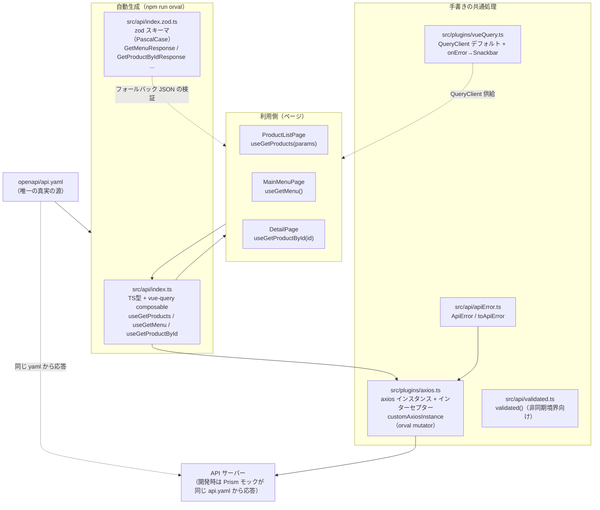
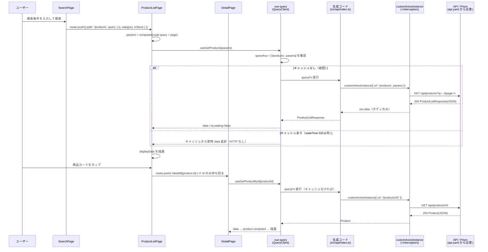
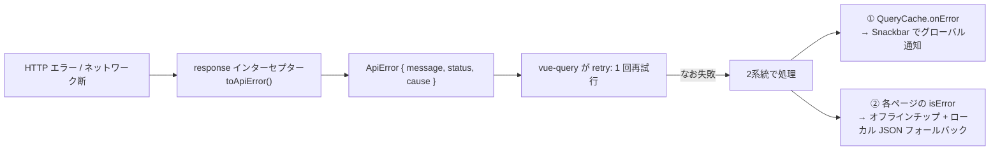

# openapi/api.yaml 起点のデータ取得フロー — orval + zod + vue-query

`openapi/api.yaml` を唯一の真実の源として、orval が型・vue-query composable・zod スキーマを自動生成し、ページが値を取得して表示するまでの流れをまとめる。

関連ドキュメント:
- 設計スペック: [superpowers/specs/2026-07-03-data-fetching-architecture-design.md](./superpowers/specs/2026-07-03-data-fetching-architecture-design.md)
- 実装プラン: [superpowers/plans/2026-07-03-data-fetching-architecture.md](./superpowers/plans/2026-07-03-data-fetching-architecture.md)

---

## 目次

1. [全体像](#全体像)
2. [① 生成フェーズ: api.yaml → orval](#①-生成フェーズ-apiyaml--orval)
3. [② 共通処理レイヤー](#②-共通処理レイヤー)
4. [③ 取得フェーズ: ページが値を得るまで](#③-取得フェーズ-ページが値を得るまで)
5. [シーケンス図: 検索 → 一覧 → 詳細](#シーケンス図-検索--一覧--詳細)
6. [zod 検証の配線ポイント](#zod-検証の配線ポイント)
7. [エラー時のフロー](#エラー時のフロー)
8. [開発フロー: API 変更時の手順](#開発フロー-api-変更時の手順)

---

## 全体像



ポイント:

| 原則 | 実現方法 |
|---|---|
| yaml が唯一の真実の源 | 型・composable・zod スキーマ・モックサーバー（Prism）がすべて同じ `api.yaml` から派生。手書きの型とのズレが構造的に起きない |
| サーバーデータは vue-query | ページまたぎの再利用は queryKey 共有のキャッシュが解決。ストアへの「持ち回りコード」は不要 |
| UI 状態は Pinia / route query | 検索条件は route query、選択 id は route param。データ本体ではなく**キー**を持ち回る |
| 自動生成物は編集禁止 | `src/api/index.ts` / `src/api/index.zod.ts` は `npm run orval` で再生成。テスト対象外 |

---

## ① 生成フェーズ: api.yaml → orval

### orval.config.ts（2エントリ構成）

```typescript
export default defineConfig({
  // ① vue-query composable + TS 型
  api: {
    input: './openapi/api.yaml',
    output: {
      target: './src/api/index.ts',
      client: 'vue-query',
      // httpClient を省略すると fetch 用のラップ型 ({data,status,headers}) が生成され mutator と非互換になるため必須
      httpClient: 'axios',
      override: {
        mutator: {
          path: './src/plugins/axios.ts',
          name: 'customAxiosInstance',
        },
      },
    },
  },
  // ② zod スキーマ
  apiZod: {
    input: './openapi/api.yaml',
    output: {
      target: './src/api/index.zod.ts',
      client: 'zod',
    },
  },
})
```

### `npm run orval` が生成するもの

`api.yaml` の `operationId`（`getMenu` / `getProducts` / `getProductById`）ごとに:

| 生成物 | 例 | 用途 |
|---|---|---|
| TS 型 | `Product`, `MenuItem`, `GetProductsParams`, `ProductListResponse` | 型注釈・props 型 |
| フェッチ関数 | `getProducts(params?)` → `Promise<ProductListResponse>` | composable の内部実装（直接も呼べる） |
| **vue-query composable** | `useGetProducts(params?, options?)` | **ページから使うのは基本これ** |
| queryKey 関数 | `getGetProductsQueryKey(params?)` | キャッシュ操作が必要な場合のみ。手書きキーは禁止 |
| zod スキーマ | `GetProductsResponse`, `GetProductByIdResponse`, `GetMenuResponse` | ランタイム検証（**PascalCase** で生成される点に注意） |

注意点（このリポジトリで実際に踏んだもの）:

- **`httpClient: 'axios'` は必須**。省略すると fetch 用のラップ型が生成され、`res.data` を返す mutator と型が合わなくなる
- **zod スキーマの export 名は PascalCase**（`getProductByIdResponse` ではなく `GetProductByIdResponse`）
- 単一 Product のスキーマは操作単位の `GetProductByIdResponse` がそれに当たる。配列が必要なら `z.array(GetProductByIdResponse)` で合成する

---

## ② 共通処理レイヤー

### 1. axios インスタンス + mutator（`src/plugins/axios.ts`）

生成コードはすべて `customAxiosInstance` を経由して HTTP を呼ぶ（orval の mutator 契約）。

```typescript
export const axiosInstance = axios.create({
  baseURL: import.meta.env.VITE_API_BASE_URL ?? '/api',
})

// 将来の認証トークン差し込み口（現状はそのまま通す）
axiosInstance.interceptors.request.use((config) => config)

// エラーを ApiError に正規化して reject
axiosInstance.interceptors.response.use(
  (response) => response,
  (error) => Promise.reject(toApiError(error)),
)

// Orval が呼ぶシグネチャ: customAxiosInstance<T>(config, options?) → Promise<T>
export const customAxiosInstance = <T>(config, options?) =>
  axiosInstance({ ...config, ...options }).then((res) => res.data)
```

### 2. エラー正規化（`src/api/apiError.ts`）

HTTP エラーはインターセプターで `ApiError { message, status, cause }` に変換される。呼び出し側は axios の内部構造（`error.response.data` 等）を知らなくてよい。

### 3. QueryClient デフォルト + グローバル通知（`src/plugins/vueQuery.ts`）

```typescript
new QueryClient({
  queryCache: new QueryCache({
    onError: (error) => {   // 全クエリのエラーを一箇所で Snackbar 通知
      const message = error instanceof ApiError ? error.message : 'データの取得に失敗しました'
      showSnack('error', message)
    },
  }),
  defaultOptions: {
    queries: {
      staleTime: 5 * 60 * 1000, // 5分: ページまたぎの再フェッチを抑制
      retry: 1,
      refetchOnWindowFocus: false,
    },
  },
})
```

`registerVueQuery(app)` は `src/plugins/index.ts` から呼ばれ、アプリ全体に適用される。テストでは `src/test/setup.ts` がテスト毎に新しい QueryClient（`retry: false`）を差し込む。

### 4. zod 検証ヘルパー（`src/api/validated.ts`）

```typescript
export const validated = async <T>(schema: ZodType<T>, promise: Promise<unknown>): Promise<T> =>
  schema.parse(await promise)
```

非同期境界（API レスポンスの明示検証・永続化復元など）向け。モジュールスコープの同期的な JSON 読み込みには生成スキーマの `.parse()` を直接使う（後述）。

---

## ③ 取得フェーズ: ページが値を得るまで

### パターン A: パラメータ付き一覧（ProductListPage）

```typescript
// 検索条件は route query から（UI 状態はデータ本体でなくキーを持ち回る）
const params = computed(() => ({
  q: queryQ.value,
  category: queryCategory.value,
  inStock: queryInStock.value || undefined,
  page: currentPage.value,
  pageSize: PAGE_SIZE,
}))

// vue-query: params の変化で自動再フェッチ・同一 queryKey はキャッシュから即表示
// ページ遷移中は前ページのデータを保持（モックへのフォールバック点滅を防ぐ）
const { data, isLoading, isError } = useGetProducts(params, {
  query: { placeholderData: keepPreviousData },
})
```

- `params` は **computed のまま渡す**（`.value` を渡さない）。生成された queryKey が ref を含むため、`currentPage` や route query の変化で自動的に再フェッチされる
- `placeholderData: keepPreviousData` により、ページ切替中も前ページの実データを表示し続ける

### パターン B: 引数なし単独取得（MainMenuPage）

```typescript
const { data, isLoading, isError } = useGetMenu()

// エラー時はローカル JSON にフォールバック（オフラインモード）
const items = computed<MenuItem[]>(() =>
  isError.value ? fallback : (data.value ?? []),
)
```

ストア不要。composable の戻り値をそのまま computed で表示に使う（単独利用パターン）。

### パターン C: route param による詳細取得（DetailPage）

```typescript
const props = defineProps<{ id: string }>()

const productId = computed(() => Number(props.id))
const { data, isError, isLoading } = useGetProductById(productId)

// API エラー時はモック JSON にフォールバック（オフラインモード）
const product = computed<Product | null>(() =>
  isError.value
    ? (mockProducts.find((p) => p.id === productId.value) ?? null)
    : (data.value ?? null),
)
```

一覧 → 詳細では **id（キー）だけ**を route param で渡す。詳細データは `useGetProductById` が取得し、一覧で同じ商品を見ていた場合でも queryKey が異なれば個別にフェッチ・キャッシュされる。

---

## シーケンス図: 検索 → 一覧 → 詳細



---

## zod 検証の配線ポイント

orval の自動レスポンス検証（`runtimeValidation`）は axios + mutator 構成では効かないため、**信頼境界で明示的に parse** する方針。

| 境界 | 方法 | 実例 |
|---|---|---|
| ローカル JSON フォールバック（同期・モジュールスコープ） | 生成スキーマの `.parse()` を直接呼ぶ | `const fallback: MenuItem[] = GetMenuResponse.parse(fallbackData)`（MainMenuPage）<br/>`const mockProducts: Product[] = z.array(GetProductByIdResponse).parse(mockProductsData)`（ProductListPage / DetailPage） |
| 非同期境界（API レスポンスの明示検証・永続化復元） | `validated(schema, promise)` | `await validated(GetProductByIdResponse, getProductById(id))`（必要になった箇所で） |

`ZodError` が throw された場合は「api.yaml とデータの乖離」= 開発時バグとして扱う。モック JSON を修正して yaml に合わせる（yaml 側を緩めない）。

---

## エラー時のフロー



- **グローバル通知**（Snackbar）と**ページ内フォールバック**（オフラインチップ + モックデータ表示）は意図的に併存
- `retry: 1` のため、フォールバック表示までにリトライ1回分の遅延がある（全体方針。急ぐクエリは `options.query.retry: 0` で個別上書き可能）
- 既知のトレードオフ: 404 とネットワークエラーはどちらも `isError` になるため、モック JSON に存在する id は API が 404 を返してもモックデータが表示される。区別が必要になったら `ApiError.status === 404` で分岐する

---

## 開発フロー: API 変更時の手順

```
1. openapi/api.yaml を編集（エンドポイント追加・スキーマ変更）
        │
2. npm run orval        ← src/api/index.ts / index.zod.ts が再生成される
        │
3. npm run type-check   ← 変更の影響箇所がコンパイルエラーとして浮き上がる
        │                  （手書きの型同期作業は不要）
4. 影響箇所を修正 → npm run test:run
        │
5. 動作確認: npm run dev:mock   ← Prism も同じ yaml から新レスポンスを返す
```

新しいエンドポイントをページで使う場合:

1. yaml に `operationId` 付きで定義 → `npm run orval`
2. ページで `useXxx()` を呼ぶ（生成された composable）
3. ローカル JSON フォールバックを持つ場合は対応する生成 zod スキーマで `.parse()`
4. queryKey・キャッシュ・ローディング状態は vue-query 任せ。手書き不要

守るべき規約:

- `src/api/index.ts` / `src/api/index.zod.ts` を**手で編集しない**
- queryKey を**手書きしない**（必要なら生成された `getXxxQueryKey()` を使う）
- サーバーデータを Pinia に**コピーしない**（キャッシュは vue-query が持つ。Pinia は UI 状態のみ）
- ページ間では**データ本体ではなくキー**（id・検索条件）を渡す
