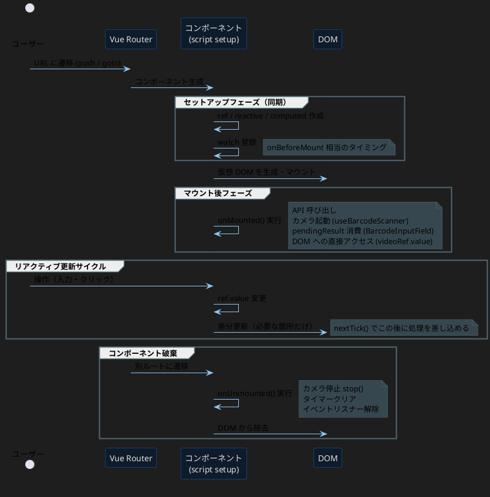
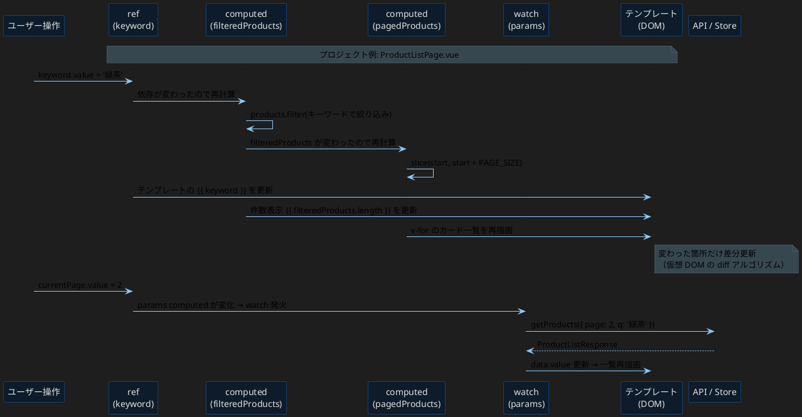
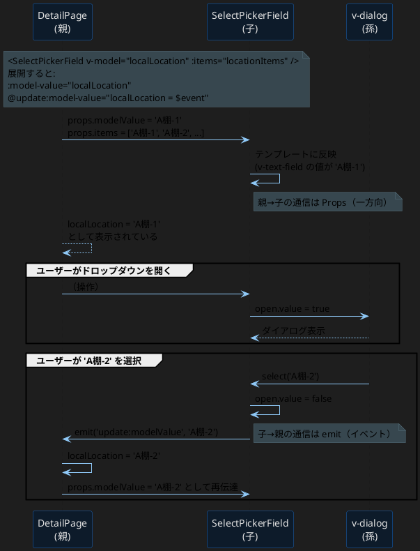
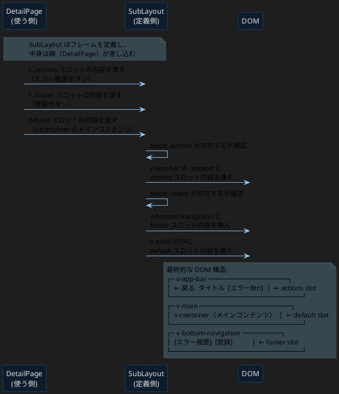
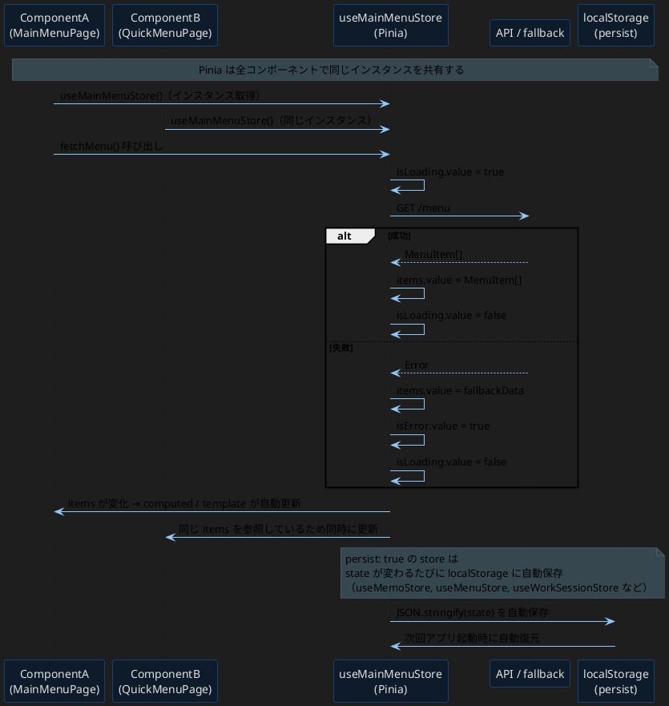
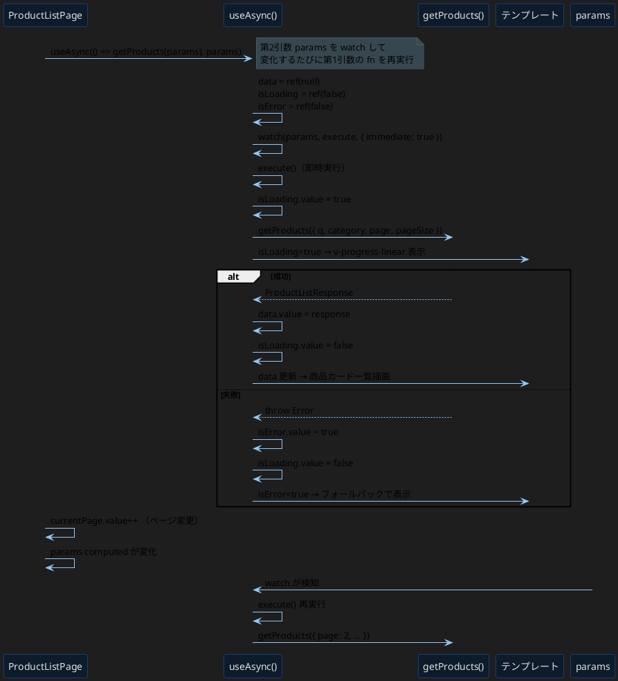
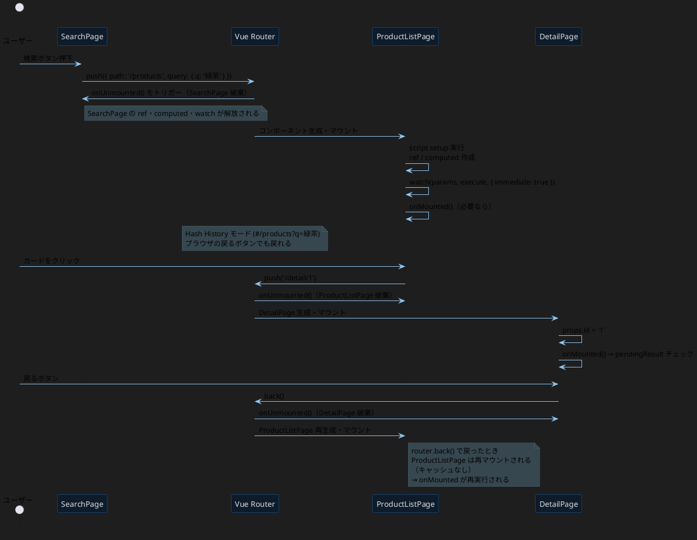
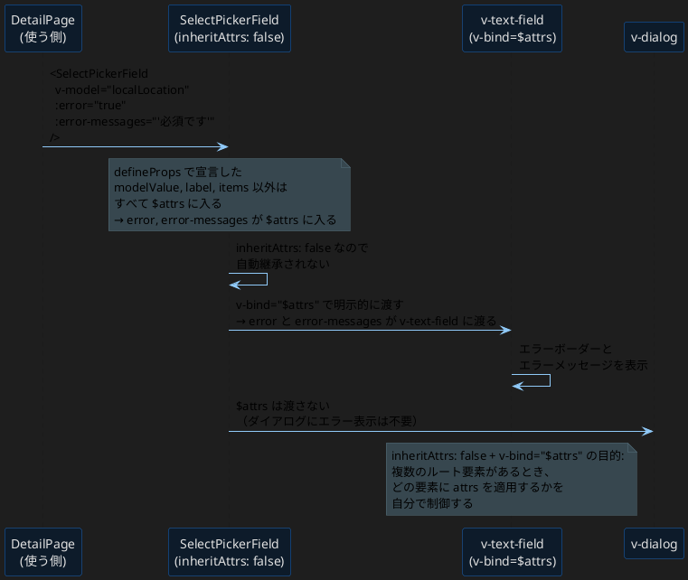
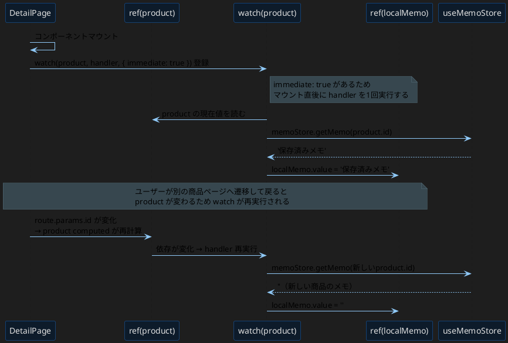

# Vue 3 概念・フロー シーケンス図

---

## 1. コンポーネントのライフサイクル

---

## 2. ref / computed / watch の連鎖

---

## 3. Props / Emits（親子コンポーネント通信）

---

## 4. v-model の双方向バインディング詳細

```plantuml
@startuml vmodel
skinparam DefaultFontName "Noto Sans JP"
skinparam BackgroundColor #1e1e1e
skinparam SequenceArrowColor #90CAF9
skinparam SequenceParticipantBorderColor #1565C0
skinparam SequenceParticipantBackgroundColor #0D1B2A
skinparam SequenceParticipantFontColor #E0E0E0
skinparam NoteBackgroundColor #37474F
skinparam NoteBorderColor #546E7A
skinparam NoteTextColor #CFD8DC

participant "親\n(keyword = ref(''))" as parent
participant "v-text-field\n(Vuetify)" as input
participant "DOM\n<input>" as dom

note over parent, dom
  <v-text-field v-model="keyword" />
  内部的には:
  :model-value="keyword"
  @update:model-value="keyword = $event"
end note

parent -> input : :model-value="keyword" で初期値を渡す
input -> dom : value 属性にセット

group ユーザーが文字を入力
  dom -> input : @input イベント発生
  input -> parent : emit('update:model-value', '緑茶')
  parent -> parent : keyword.value = '緑茶'
  note right : Vue のリアクティブ更新
  parent -> input : :model-value = '緑茶' で再バインド
  input -> dom : input の value を '緑茶' に同期
end

group プログラムから値を変更
  parent -> parent : keyword.value = ''（クリア）
  parent -> input : :model-value = '' で更新
  input -> dom : input の value を '' に同期
end

@enduml
```

---

## 5. スロットの描画フロー

---

## 6. Pinia Store の状態更新フロー

---

## 7. Composable（useAsync）の呼び出しフロー

---

## 8. Vue Router のナビゲーションフロー

---

## 9. $attrs / inheritAttrs の透過フロー

---

## 10. watch の即時実行と依存追跡

