# Store 定義書

> 新しく store を作る場合の判断基準（store か ref か・persist の付け方）は
> [チーム製造ガイド](./team-guide.md) の「4. 状態を持ちたい（store か ref か）」を参照してください。

## Store 一覧

| Store ID | ファイル | export 名 | persist | 用途 |
|---------|---------|-----------|---------|------|
| `product` | `src/stores/product.ts` | `useProductStore` | × | 商品一覧・フィルタ・ページング |
| `mainMenu` | `src/stores/menu.ts` | `useMainMenuStore` | × | メインメニューデータ（API取得） |
| `menu` | `src/stores/menuStore.ts` | `useMenuStore` | ✓ | ナビタブのカスタマイズ設定 |
| `scanner` | `src/stores/scannerStore.ts` | `useScannerStore` | × | バーコードスキャナー制御 |
| `memo` | `src/stores/memoStore.ts` | `useMemoStore` | ✓ | 商品メモ（productId → text） |
| `workSession` | `src/stores/workSessionStore.ts` | `useWorkSessionStore` | ✓ | スキャナー作業セッション |
| `theme` | `src/stores/themeStore.ts` | `useThemeStore` | ✓ | アプリテーマ選択 |
| `settings` | `src/stores/settingsStore.ts` | `useSettingsStore` | ✓ | アプリ設定 |

---

## 1. product store

**ファイル**: `src/stores/product.ts`  
**Store ID**: `product`

### State

| 名前 | 型 | 初期値 | 説明 |
|------|----|--------|------|
| `products` | `Product[]` | `mockProducts` | 全商品データ（現在はモック） |
| `keyword` | `string` | `''` | キーワード検索条件 |
| `selectedCategory` | `string` | `''` | カテゴリフィルタ |
| `inStockOnly` | `boolean` | `false` | 在庫ありフィルタ |
| `currentPage` | `number` | `1` | 現在ページ番号 |
| `selectedProduct` | `Product \| null` | `null` | 選択中商品 |

### Getters

| 名前 | 戻り値型 | 説明 |
|------|---------|------|
| `filteredProducts` | `Product[]` | keyword / category / inStock で絞り込んだ結果 |
| `totalPages` | `number` | `Math.ceil(filteredProducts.length / PAGE_SIZE)` |
| `pagedProducts` | `Product[]` | currentPage に対応するページ分 |

### Actions

| 名前 | 引数 | 説明 |
|------|------|------|
| `resetPage()` | - | `currentPage = 1` |
| `selectProduct(product)` | `Product` | `selectedProduct` に格納 |

> **備考**: ProductListPage は useAsync + getProducts() を直接使い、このストアは SearchPage 経由の簡易フィルタ用途と DetailPage での `id` 検索に使用。

---

## 2. mainMenu store

**ファイル**: `src/stores/menu.ts`  
**Store ID**: `mainMenu`

### State

| 名前 | 型 | 初期値 | 説明 |
|------|----|--------|------|
| `items` | `MenuItem[]` | `[]` | メインメニュー項目 |
| `isLoading` | `boolean` | `false` | ローディング中フラグ |
| `isError` | `boolean` | `false` | API エラーフラグ |

### Actions

| 名前 | 引数 | 説明 |
|------|------|------|
| `fetchMenu()` | - | `GET /menu` → 成功で `items` 更新 / 失敗で `main-menu.json` にフォールバック |

### フォールバックデータ

`src/data/main-menu.json`（7カテゴリ / 計15サブメニュー）

---

## 3. menu store（ナビタブカスタマイズ）

**ファイル**: `src/stores/menuStore.ts`  
**Store ID**: `menu`  
**persist**: `true`（pinia-plugin-persistedstate）

### マスタデータ

```ts
MENU_MASTER = [
  { id: 'search',    label: '商品を探す',  icon: 'mdi-magnify',        to: '/search'    },
  { id: 'favorites', label: 'お気に入り',  icon: 'mdi-heart',          to: '/favorites' },
  { id: 'settings',  label: '設定',        icon: 'mdi-cog',            to: '/settings'  },
  { id: 'samples',   label: 'コンポーネント', icon: 'mdi-palette-swatch', to: '/samples' },
  { id: 'scanner',   label: 'スキャナー',  icon: 'mdi-barcode-scan',   to: '/scanner'   },
]
```

### State

| 名前 | 型 | 初期値 | 説明 |
|------|----|--------|------|
| `visibleIds` | `string[]` | 全 MENU_MASTER の id | クイックメニューに表示する項目の順序 |

### Getters

| 名前 | 戻り値型 | 説明 |
|------|---------|------|
| `visibleItems` | `MenuItem[]` | visibleIds 順に並んだ表示項目 |
| `hiddenItems` | `MenuItem[]` | 非表示の項目（追加候補） |
| `canAddMore` | `boolean` | `visibleIds.length < 9` |

### Actions

| 名前 | 引数 | 説明 |
|------|------|------|
| `addToVisible(id)` | `string` | 非表示項目を追加（上限9件） |
| `removeFromVisible(id)` | `string` | 表示から除外 |
| `reorder(newIds)` | `string[]` | 表示順を変更 |

---

## 4. scanner store

**ファイル**: `src/stores/scannerStore.ts`  
**Store ID**: `scanner`

### State

| 名前 | 型 | 初期値 | 説明 |
|------|----|--------|------|
| `mode` | `'single' \| 'continuous'` | `'single'` | スキャンモード |
| `title` | `string \| undefined` | `undefined` | スキャナー画面タイトル |
| `pendingResult` | `ScanResult \| null` | `null` | 戻り後に消費される単発スキャン結果 |

### `ScanResult` 型

```ts
interface ScanResult {
  text: string    // バーコード値
  format: string  // QR_CODE / EAN_13 / CODE_128 / MOCK など
  timestamp: number
}
```

### Actions

| 名前 | 引数 | 説明 |
|------|------|------|
| `requestScan(mode, callback, title?)` | - | スキャナー起動 → push('/scanner') |
| `complete(results)` | `ScanResult[]` | single: pendingResult 格納 → back() |
| `consumePendingResult()` | - | pendingResult を取り出しクリア（BarcodeInputField.onMounted で呼ぶ） |
| `cancel()` | - | コールバックをクリア → back() |

---

## 5. memo store

**ファイル**: `src/stores/memoStore.ts`  
**Store ID**: `memo`  
**persist**: `true`

### State

| 名前 | 型 | 初期値 | 説明 |
|------|----|--------|------|
| `memos` | `Record<number, string>` | `{}` | productId → メモテキスト |

### Actions

| 名前 | 引数 | 説明 |
|------|------|------|
| `setMemo(productId, text)` | `number, string` | メモを保存 |
| `getMemo(productId)` | `number` → `string` | メモを取得（なければ ''） |
| `hasMemo(productId)` | `number` → `boolean` | メモが存在するか |

---

## 6. workSession store

**ファイル**: `src/stores/workSessionStore.ts`  
**Store ID**: `workSession`  
**persist**: `true`

### State

| 名前 | 型 | 初期値 | 説明 |
|------|----|--------|------|
| `currentSession` | `WorkSession \| null` | `null` | 現在の作業セッション |

### `WorkSession` 型

```ts
interface WorkSession {
  id: string
  type: 'scanner'
  title: string
  route: string       // 再開先 URL
  startedAt: string   // ISO 8601
  updatedAt: string
  state: ScannerSessionState  // { barcodes: string[], memo: string }
}
```

### Getters

| 名前 | 戻り値型 | 説明 |
|------|---------|------|
| `hasActiveSession` | `boolean` | セッション存在チェック |
| `sessionLabel` | `string` | 「スキャナー作業を再開」など |
| `sessionSubLabel` | `string` | 「N件 · HH:MM 開始」 |

### Actions

| 名前 | 引数 | 説明 |
|------|------|------|
| `startScannerSession()` | - | 新しいスキャナーセッションを開始 |
| `updateBarcodes(barcodes)` | `string[]` | スキャン結果を更新 |
| `updateMemo(memo)` | `string` | メモを更新 |
| `clearSession()` | - | セッションをクリア |

---

## 7. theme store

**ファイル**: `src/stores/themeStore.ts`  
**Store ID**: `theme`  
**persist**: `true`（pinia-plugin-persistedstate。手書き localStorage は廃止）

### State

| 名前 | 型 | 初期値 | 説明 |
|------|----|--------|------|
| `currentTheme` | `'dark' \| 'light' \| 'practice'` | `'dark'` | 現在のテーマ |

### テーマ定義

| key | ラベル | 特徴 |
|-----|--------|------|
| `dark` | ダーク | 目に優しい暗い配色 |
| `light` | ライト | 薄青基調の明るい配色 |
| `practice` | プラクティス | オレンジ基調 |

### Actions

| 名前 | 引数 | 説明 |
|------|------|------|
| `setTheme(theme)` | `AppTheme` | テーマ変更（`persist: true` により localStorage への保存は自動） |

---

## 8. settings store

**ファイル**: `src/stores/settingsStore.ts`  
**Store ID**: `settings`  
**persist**: `true`（pinia-plugin-persistedstate。手書き localStorage は廃止）

### State

| 名前 | 型 | 初期値 | 説明 |
|------|----|--------|------|
| `errorHistoryLimit` | `number` | `100` | エラー履歴の最大保持件数（1〜1000） |

> **設定方法**: 設定ページ (`/settings`) の「エラー履歴の保持件数」フィールドから変更。`persist: true` により変更後すぐに localStorage へ保存される。

---

## Store 間の依存関係

```plantuml
@startuml store-dependency
skinparam DefaultFontName "Noto Sans JP"
skinparam BackgroundColor #1e1e1e
skinparam ArrowColor #90CAF9
skinparam RectangleBorderColor #546E7A
skinparam RectangleBackgroundColor #263238
skinparam RectangleFontColor #E0E0E0

rectangle "scannerStore" as ss
rectangle "workSessionStore" as ws
rectangle "productStore" as ps
rectangle "mainMenuStore" as mms
rectangle "memoStore" as ms
rectangle "menuStore (nav)" as mn
rectangle "themeStore" as ts
rectangle "settingsStore" as sets

rectangle "ScannerPage" as scan
rectangle "DetailPage" as dp
rectangle "ProductListPage" as plp
rectangle "MainMenuPage" as mmp
rectangle "QuickMenuPage" as qmp
rectangle "SettingsPage" as sp

scan --> ss : complete / cancel
scan --> ws : startSession / clearSession
dp --> ss : consumePendingResult
dp --> ps : products.find(id)
dp --> ms : getMemo / setMemo
dp --> sets : errorHistoryLimit
plp --> ps : (直接 useAsync 経由)
mmp --> mms : fetchMenu / items
qmp --> mn : visibleItems
qmp --> ws : hasActiveSession
sp --> ts : setTheme
sp --> mn : add/remove/reorder
sp --> sets : errorHistoryLimit

@enduml
```


