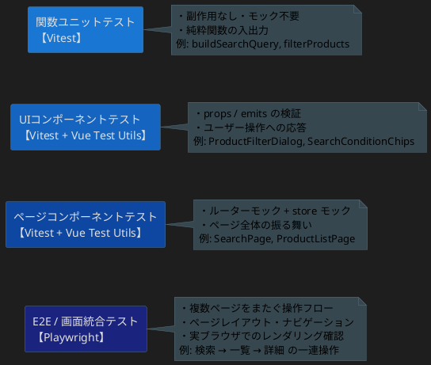
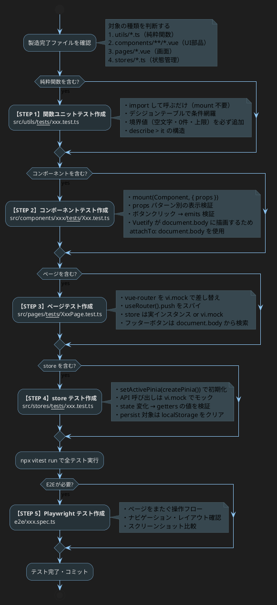
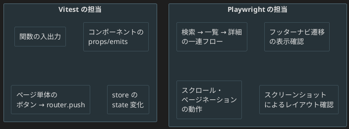

# テスト作成フロー

## テスト戦略の全体像



---

## フロー：製造完了 → テスト作成



---

## テスト種別と配置場所

| 種別 | 対象 | 配置場所 | ツール |
|------|------|---------|--------|
| 関数ユニット | `src/utils/*.ts` | `src/utils/__tests__/` | Vitest |
| コンポーネント | `src/components/**/*.vue` | `src/components/xxx/__tests__/` | Vitest + Vue Test Utils |
| ページ | `src/pages/*.vue` | `src/pages/__tests__/` | Vitest + Vue Test Utils |
| Store | `src/stores/*.ts` | `src/stores/__tests__/` | Vitest |
| E2E | 画面フロー全体 | `e2e/` | Playwright |

---

## STEP 1：関数ユニットテスト（Vitest）

### 対象
`src/utils/` 以下の純粋関数。mount 不要・モック不要。

### パターン

```ts
// src/utils/__tests__/searchUtils.test.ts
import { describe, it, expect } from 'vitest'
import { buildSearchQuery, filterProducts } from '../searchUtils'

describe('buildSearchQuery', () => {
  // デシジョンテーブルで全条件の組み合わせを網羅
  it('[BQ-1] すべて空のとき空オブジェクトを返す', () => {
    expect(buildSearchQuery('', '', false)).toEqual({})
  })
  it('[BQ-9] 空白のみのkeywordはqに含めない（境界値）', () => {
    expect(buildSearchQuery('   ', '食品', false)).toEqual({ category: '食品' })
  })
})
```

### チェックリスト

- [ ] 正常系：全条件 ON / 一部 ON / 全条件 OFF
- [ ] 境界値：空文字・空白のみ・0件・最大件数
- [ ] 異常系：undefined・null に耐えるか（型で守られているなら不要）

---

## STEP 2：コンポーネントテスト（Vitest + Vue Test Utils）

### 対象
`src/components/` 以下の `.vue` ファイル。props・emits・DOM 表示を検証。

### パターン

```ts
// src/components/search/__tests__/SearchConditionChips.test.ts
import { describe, it, expect } from 'vitest'
import { mount } from '@vue/test-utils'
import SearchConditionChips from '../SearchConditionChips.vue'

describe('SearchConditionChips', () => {
  it('条件なしのとき「条件なし（全件）」を表示', () => {
    const wrapper = mount(SearchConditionChips)
    expect(wrapper.text()).toContain('条件なし（全件）')
  })

  it('q を渡すとキーワードチップを表示', () => {
    const wrapper = mount(SearchConditionChips, { props: { q: '緑茶' } })
    expect(wrapper.text()).toContain('緑茶')
  })

  it('リセットボタンクリックで reset emit', async () => {
    const wrapper = mount(SearchConditionChips, {
      props: { q: '緑茶', closable: true },
      attachTo: document.body,       // Vuetify teleport 対策
    })
    const btn = document.body.querySelector('[data-testid="reset"]')
    btn?.click()
    await wrapper.vm.$nextTick()
    expect(wrapper.emitted('reset')).toBeTruthy()
    wrapper.unmount()                // 必ず後片付け
  })
})
```

### チェックリスト

- [ ] props のパターン別に表示内容が変わるか
- [ ] ユーザー操作（クリック）→ emit が発火するか
- [ ] `attachTo: document.body` + `wrapper.unmount()` で後片付けをする
- [ ] Vuetify ダイアログは `document.body.textContent` で確認

---

## STEP 3：ページテスト（Vitest + Vue Test Utils）

### 対象
`src/pages/` 以下。ルーター遷移と store との連携を検証。

### パターン

```ts
// src/pages/__tests__/SearchPage.test.ts
import { describe, it, expect, vi, beforeEach } from 'vitest'
import { mount, flushPromises } from '@vue/test-utils'
import { createRouter, createMemoryHistory } from 'vue-router'
import SearchPage from '../SearchPage.vue'

const mockPush = vi.fn()
// vue-router を丸ごとモック
vi.mock('vue-router', async (importOriginal) => {
  const actual = await importOriginal<typeof import('vue-router')>()
  return {
    ...actual,
    useRouter: () => ({ push: mockPush, back: vi.fn() }),
    useRoute: () => ({ path: '/search', query: {} }),
  }
})

// Vuetify の v-bottom-navigation がルーターを要求するため最小構成で用意
function makeRouter() {
  return createRouter({
    history: createMemoryHistory(),
    routes: [
      { path: '/', component: { template: '<div />' } },
      { path: '/search', component: { template: '<div />' } },
      { path: '/products', component: { template: '<div />' } },
    ],
  })
}

describe('SearchPage', () => {
  beforeEach(() => mockPush.mockClear())

  it('キーワード入力後に検索すると /products に push', async () => {
    const wrapper = mount(SearchPage, {
      global: { plugins: [makeRouter()] },
      attachTo: document.body,
    })
    await wrapper.find('input').setValue('緑茶')

    const btn = Array.from(document.body.querySelectorAll('button'))
      .find(b => b.textContent?.includes('検索'))
    btn?.click()
    await flushPromises()

    expect(mockPush).toHaveBeenCalledWith({
      path: '/products',
      query: { q: '緑茶' },
    })
    wrapper.unmount()
  })
})
```

### チェックリスト

- [ ] `vi.mock('vue-router', ...)` で push / back をスパイ
- [ ] `vi.mock('@/stores/xxx', ...)` で store が必要な場合はモック
- [ ] フッターボタンは `document.body.querySelectorAll('button')` で取得
- [ ] `await flushPromises()` で非同期処理の完了を待つ
- [ ] テストごとに `wrapper.unmount()` で後片付け

---

## STEP 4：Store テスト（Vitest）

### 対象
`src/stores/` 以下。API コールをモックして state / getters の変化を検証。

### パターン

```ts
// src/stores/__tests__/menu.test.ts
import { describe, it, expect, vi, beforeEach } from 'vitest'
import { setActivePinia, createPinia } from 'pinia'
import { useMainMenuStore } from '../menu'

// API モジュールをモック
vi.mock('@/api/index', () => ({
  getAppAPI: () => ({
    getMenu: vi.fn().mockResolvedValue([
      { id: 'order', label: '受注管理', icon: 'mdi-list', children: [] },
    ]),
  }),
}))

describe('useMainMenuStore', () => {
  beforeEach(() => {
    setActivePinia(createPinia())
  })

  it('fetchMenu 成功時に items が更新される', async () => {
    const store = useMainMenuStore()
    expect(store.items).toHaveLength(0)

    await store.fetchMenu()

    expect(store.items).toHaveLength(1)
    expect(store.items[0].label).toBe('受注管理')
    expect(store.isError).toBe(false)
  })

  it('fetchMenu 失敗時にフォールバックデータが入る', async () => {
    // getMenu を失敗させる
    vi.mocked(require('@/api/index').getAppAPI().getMenu).mockRejectedValueOnce(new Error())
    const store = useMainMenuStore()
    await store.fetchMenu()

    expect(store.isError).toBe(true)
    expect(store.items.length).toBeGreaterThan(0) // fallback JSON
  })
})
```

### チェックリスト

- [ ] `setActivePinia(createPinia())` を `beforeEach` で必ず呼ぶ
- [ ] API は `vi.mock('@/api/index', ...)` でモック
- [ ] persist store は `localStorage.clear()` を `beforeEach` に追加
- [ ] getters の値も state 変化に合わせて確認する

---

## STEP 5：E2E テスト（Playwright）

### 役割と適用範囲

Vitest（コンポーネント・ページ単体）では検証できない、**複数ページにまたがる操作フロー**と**実ブラウザでのレイアウト**を確認する。



### パターン（検索フロー）

```ts
// e2e/search.spec.ts
import { test, expect } from '@playwright/test'

test('検索 → 一覧 → 詳細の一連フロー', async ({ page }) => {
  await page.goto('/#/search')

  // キーワード入力
  await page.fill('input[placeholder*="キーワード"]', '緑茶')

  // 検索ボタン押下
  await page.getByRole('button', { name: '検索' }).click()

  // 一覧ページに遷移したことを確認
  await expect(page).toHaveURL(/#\/products/)
  await expect(page.getByText('件')).toBeVisible()

  // 商品カードをクリック
  await page.locator('.v-card').first().click()

  // 詳細ページに遷移したことを確認
  await expect(page).toHaveURL(/#\/detail\//)
  await expect(page.getByText('基本情報')).toBeVisible()
})

test('フッターナビで各タブに遷移できる', async ({ page }) => {
  await page.goto('/#/')

  await page.getByRole('button', { name: 'メニュー' }).click()
  await expect(page).toHaveURL(/#\/menu/)

  await page.getByRole('button', { name: '検索' }).click()
  await expect(page).toHaveURL(/#\/search/)
})
```

### Playwright のセットアップ

```bash
npm install -D @playwright/test
npx playwright install chromium

# playwright.config.ts
# baseURL: 'http://localhost:5173'
# testDir: './e2e'
```

---

## 検索画面テストカバレッジ（現状）

| ファイル | テストファイル | カバー状況 |
|---------|--------------|-----------|
| `src/utils/searchUtils.ts` | `src/utils/__tests__/searchUtils.test.ts` | ✅ 完了（デシジョンテーブル網羅） |
| `src/components/search/SearchConditionChips.vue` | `src/components/search/__tests__/SearchConditionChips.test.ts` | ✅ 完了 |
| `src/components/search/ProductFilterDialog.vue` | `src/components/search/__tests__/ProductFilterDialog.test.ts` | ✅ 完了 |
| `src/pages/SearchPage.vue` | `src/pages/__tests__/SearchPage.test.ts` | ✅ 完了 |
| `src/pages/ProductListPage.vue` | 未作成 | ❌ 要追加 |
| 検索 → 一覧 → 詳細フロー | `e2e/search.spec.ts` | ❌ 要追加（Playwright） |

---

## よく使うコマンド

```bash
# 全テスト実行
npx vitest run

# ウォッチモード（開発中）
npx vitest

# カバレッジ付き
npx vitest run --coverage

# 特定ファイルのみ
npx vitest run src/utils/__tests__/searchUtils.test.ts

# E2E（Playwright）
npx playwright test
npx playwright test --ui       # GUI モード
npx playwright test e2e/search.spec.ts
```
